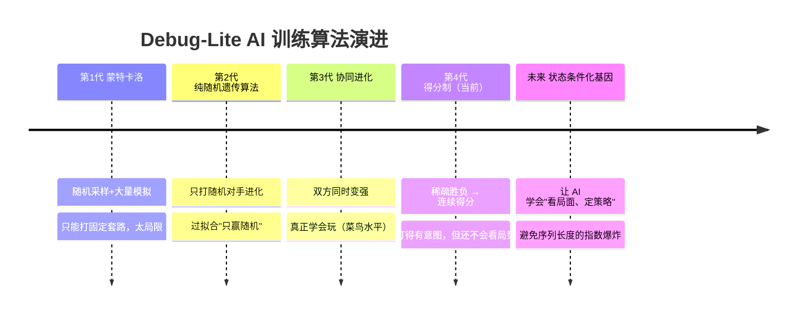

# Debug-Lite AI 训练算法演进记录

> 版本：v1.0  
> 记录本游戏 AI 从"只会打随机"到"勉强会玩"的完整进化历程、每一代方法的动机与教训，以及未来的计划。  
> 相关代码：`server/train-ai.js`（训练器）、`server/reward.js`（得分制奖励）、`server/index.js`（局内 AI 应用）

---

## 目录

1. [背景：这个游戏的 AI 挑战](#1-背景这个游戏的-ai-挑战)
2. [演进总览](#2-演进总览)
3. [第一代：蒙特卡洛](#3-第一代蒙特卡洛)
4. [第二代：纯随机遗传算法](#4-第二代纯随机遗传算法)
5. [第三代：协同进化](#5-第三代协同进化)
6. [第四代（当前）：得分制奖励](#6-第四代当前得分制奖励)
7. [当前架构速览](#7-当前架构速览)
8. [未来计划](#8-未来计划)
9. [业界做法参考](#9-业界做法参考)
10. [附录：训练命令](#10-附录训练命令)

---

## 1. 背景：这个游戏的 AI 挑战

Debug-Lite 是 16 格横版双人同时行动游戏：

- **双盲回合制**：双方每回合**同时预编 16 格行动序列**，提交后统一结算 → 第一回合双方都是"盲猜"，从第二回合起才能根据战况（对方是否偷家、要不要回防/换家）调整打法。
- **状态跨回合继承**：角色 HP / MP / SP、基地血量都在回合间保留（基地可以被持续消耗，是真正的战略目标）。
- **行动空间大**：每格可选 6 种基础行动 + 3 个技能，16 格序列的组合空间极大，暴力搜索不可行。
- **没有人类高手**：游戏刚诞生 5 天，无人对局过，没有任何"正确打法"可以抄 → AI 必须**自己摸索策略**。

这决定了 AI 不能靠"抄高手复盘"或"写死规则"来变强，必须走**自学习**路线。

---

## 2. 演进总览



| 代次 | 方法 | 核心缺陷 | 结果 |
|------|------|---------|------|
| 1 | 蒙特卡洛 | 采样覆盖有限、序列静态 | 只能打固定套路，被反制即失效 |
| 2 | 纯随机遗传算法 | 对手太弱（随机） | 练出的 AI **只能打赢随机序列** |
| 3 | 协同进化（双向对抗） | 适应度仍只看输赢（稀疏） | **真正学会玩**（虽然只是菜鸟） |
| 4 | 得分制奖励（当前） | 序列固定、不看局势 | 会看血量/基地、打得有意图，但不会"根据局势换打法" |

---

## 3. 第一代：蒙特卡洛

**做法**：随机采样大量 16 格行动序列，对每条序列做蒙特卡洛模拟（打很多场），用统计胜率估计其强度，最后挑胜率最高的序列使用。

**发现的问题**：
- **覆盖有限**：采样再多，也只是在巨大行动空间里捞了几条"对某个对手不错"的序列，无法覆盖各种战局。
- **序列是死的**：选出来的是固定套路，不随局面变化，一旦对手看穿针对性反制就失效。
- **估计噪声大**：有限对局数下胜率估计方差大，选出来的不一定真是最强的。

**结论**：太局限，弃用。

---

## 4. 第二代：纯随机遗传算法

**做法**：把 16 格序列当作"基因"，用经典遗传算法（种群、交叉、变异、选择精英）在序列空间里进化搜索更强的序列。

**发现的问题（关键教训）**：
- 进化的对手是**固定随机序列**（或纯随机），导致适应度 = "打随机的胜率"。
- 于是进化奖励的是**专门克制随机**的招式组合 → 严重过拟合。
- 练出来的 AI 打随机时胜率很高，但面对任何"稍微有策略"的对手就崩。

> **核心教训：评估对手的质量决定了 AI 的水平上限——AI 永远只能强过它练过的对手。**

---

## 5. 第三代：协同进化

**做法**：被训练角色（P2）与陪训角色（P1）**同时进化**：

- 第 1 轮：双方纯随机序列互打，各取胜率 Top-K。
- 第 2~N 轮：双方各自从上一轮 Top-K 变异出新的种群，两两对抗，再各取 Top-K。
- P1、P2 的种子各自独立、互不污染，在同一水平线上公平竞争。

**效果**：因为对手也在持续变强，AI 被迫不断学习应对更强的策略，训练中**涌现出真正的玩法**——走位、进攻、防守、拆基地等行为是"打出来的"而不是"教出来的"。这是 AI **第一次真正学会玩这个游戏**（虽然水平仍只是菜鸟）。

**遗留问题**：
- 适应度仍只看**输赢**（稀疏奖励）：一局只给一个 0/1 信号，打得好但输了 = 0 分，进化缺少梯度。
- 基因仍是**固定序列**，训练与局内使用都不看局势。

---

## 6. 第四代（当前）：得分制奖励

**动机**：稀疏的胜负信号无法告诉进化"这局哪里打得好"。改为按每回合战况累计**连续得分**。

### 6.1 得分公式（零和）

以 P2 视角（P1 对称取反，保证零和）：

```
roundScore(P2) = w_hp · 角色血量净优势 + w_base · 基地血量净优势
gameScore(P2)  = Σ 各回合 roundScore + w_win · 胜负加分
```

- **角色血量净优势** =（敌方掉血 − 我方掉血，按各自 maxHp 归一化）→ 攻击敌人 + 保护自己
- **基地血量净优势** =（敌方基地掉血 − 我方基地掉血，按 maxHp 归一化）→ 攻击/防守基地
- **击杀 / 拆塔不单独计分**：击杀 = 敌方血量清零、拆塔 = 基地血量清零，已完整计入血量项，同时它们又决定胜负，由 `w_win` 兜底，避免重复计分
- 默认权重：`w_hp=1.0`、`w_base=1.5`（略高鼓励拆塔）、`w_win=3.0`

### 6.2 两个关键性质

1. **零和**：`P2得分 = −P1得分`，维持对抗压力，避免"双方互蹲各得高分"的退化策略被奖励。
2. **回合数不产生额外分数**：各回合血量/基地差值累加会"望远镜式抵消"成整局总伤害差——早赢晚赢得分相同，不存在"拖回合刷分"。

### 6.3 配套修复与优化

- **修复基地跨回合重置 bug**：训练模拟曾把基地每回合重置为满血，与真实游戏（基地跨回合继承）不一致 → 改为通过 `_inheritBases` 跨回合继承，训练环境与真实对局一致。
- **8:2 混合迭代**：第 2+ 轮 80% 从精英变异 + 20% 全新随机基因，防止第一轮基因局限导致基因池过早固化。
- **超参重调**：每对默认 2 场（得分制密集奖励下 20 场过剩，每基因约 120 场）、种子 `TOP_K=20`（可 `--topk`）、快速模式每对 1 场。

**结果**：AI 开始"看血量、有意图地进攻/拆塔"，打起来更聪明了。**但仍有天花板**——序列固定、局内不看局势，还没学会"第二回合判断对方偷家 → 回防还是换家"。

---

## 7. 当前架构速览

```
train-ai.js（离线训练）
  GA + 双向对抗 + 得分制 → 每个角色 vs 每个角色 的 Top-N 基因序列
        │
        ▼
data/ai-weights.json / ai-templates.json（训练产物）
        │
        ▼
index.js generateAIActionsSmart（局内应用）
  从该对阵 Top-N 中按 fitness 加权随机抽一条 16 格序列
  → 逐格校验合法性（CD/资源不足则 fallback 随机或 wait）
  → 加 0~3 个随机扰动 tick（避免完全可预测）
```

- `server/train-ai.js`：训练器主体（GA + 双向对抗 + 得分制 + 8:2 混合）
- `server/reward.js`：得分制奖励纯函数（可单测）
- `server/index.js`：局内 AI 应用（当前为"状态盲"的 top-N 随机抽取）

---

## 8. 未来计划

核心方向：**让 AI 真正"看懂"局面，自己摸索出强策略**——不注入任何手写策略。游戏没有高手可抄，所以只提供"客观可观测状态"作为输入，具体打法交给进化自己发现。

### 8.1 核心思路：状态条件化基因

当前 AI 的天花板在于：**基因是"死的"固定序列，训练与局内使用都不看当前局面**——它最多学会一条"平均不错"的万能开局，学不会"第二回合发现对方偷家 → 回防还是换家"。

未来计划的核心，是把**当前局面纳入基因的决策**：

- 基因不再是一条固定 16 格序列，而是"**状态 → 行为**"的函数：同一套基因，喂入不同的局面（我方/敌方血量、基地血量、距离、回合号…），会输出不同的编排。
- 于是 AI **自然学会"看状态、定策略"**：局面特征表明"对方基地残血"时它倾向进攻拆塔，"我方基地被偷"时倾向回防——这些策略是进化自己从对抗数据里撞出来的，不是人写的规则。

**为什么不做"多回合随机序列"训练**：如果试图直接搜索"覆盖多个回合的随机序列"来学策略，训练复杂度会随序列长度**指数级爆炸**——每格有 A 种可选行动，长度为 L 的序列就有 A^L 种组合，搜索不可行。状态条件化把复杂度从"序列组合"降为"状态特征 × 单回合序列"的可控规模：每回合只需根据当前状态决定一条 16 格序列，状态用少量特征桶压缩即可。

### 8.2 落地路径

1. **状态特征化**：定义一组"客观可观测"的特征（不含任何策略）——我方/敌方 HP 桶、我方/敌方基地 HP 桶、双方位置与朝向、回合号、敌方是否贴近我基地（"偷家"信号）等，粗分桶后作为基因的输入。
2. **条件化表示与进化**：把个体从"一条序列"扩展为"开局盲选序列 + 各局面桶对应的序列"；进化同时优化序列内容与"桶 → 序列"的映射。评估沿用得分制 + 双向对抗（已具备）。
3. **局内应用**：`generateAIActionsSmart` 改为"算当前局面 → 取条件化基因 → 播 16 格"，替换当前"状态盲"的 top-N 随机抽取。

### 8.3 后续可选增强

- **自对弈 MCTS**：把"每回合选哪条序列"当规划问题，用已训基因当 rollout 策略做树搜索，最接近"真人级自适应"，但工作量明显更大。
- **速胜奖励**：当前无"赢得快"的激励（早赢晚赢得分相同），可加按剩余回合加权的胜负加分。
- **A/B 对比评估**：旧（纯胜负）vs 新（得分制）各训练一版互相对打，量化提升幅度。
- **奖励权重调优**：`--w-base` / `--w-win` 等参数的人测调优。

---

## 10. 附录：训练命令

```bash
# 全部角色互训（快速基线，约 1 分钟）
node server/train-ai.js --pop 80 --rounds 5

# 深度训练（约 1 小时，能打的基线）
node server/train-ai.js --pop 130 --rounds 20 --matches 3 --topk 35

# 快速验证
node server/train-ai.js --quick --p2 warrior --p1 archer --pop 20 --rounds 3
```

完整参数说明见 [README](../README.md) 的「AI 训练」章节。