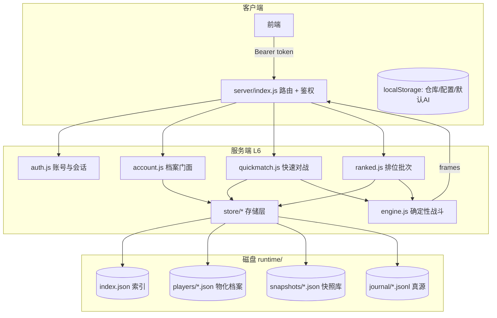

# 账号与存档系统 详细设计（在线服务层）

> 所属：Debug-Lite v3　版本：v1　创建：2026-09-16
> 定位：**玩家档案持久化 + 异步排位 + 快速对战（积分）** 的唯一权威设计。精确到代码逻辑（自然语言，不写实现代码；数据结构用 JSONC 表达）。
> 权威链：`docs/decisions.md` > `docs/systems/*`（本文档） > `docs/v3-design.md` > `docs/interfaces.md` > `docs/tasks.md`。
> 相关文档：`docs/systems/10-ranked.md`（排位批次规则，本文档接管其持久化部分）、`docs/server.md`（部署与端点速查）、`docs/interfaces.md`（HTTP 契约）。
> **本文档推翻 D-123 的「本轮不做存档」**：新增 D-129…D-136（见附录 A），D-122（晋升 x=6）、D-01…D-128 的引擎与数值条款**全部继续有效**。

---

## 目录

1. [需求与范围](#1-需求与范围)
2. [术语](#2-术语)
3. [架构总览](#3-架构总览)
4. [身份与鉴权](#4-身份与鉴权)
5. [存档模型](#5-存档模型)
6. [写入模型与一致性](#6-写入模型与一致性)
7. [异步排位](#7-异步排位)
8. [快速对战与积分](#8-快速对战与积分)
9. [战绩与回放](#9-战绩与回放)
10. [HTTP API 增量契约](#10-http-api-增量契约)
11. [容量、性能与数据库抉择](#11-容量性能与数据库抉择)
12. [日志、审计与可观测性](#12-日志审计与可观测性)
13. [测试要点](#13-测试要点)
14. [实施计划](#14-实施计划)
15. [风险与开放问题](#15-风险与开放问题)
- [附录 A：新增决策（D-129…D-136）草案](#附录-a新增决策d-129d-136草案)
- [附录 B：其他文档同步清单](#附录-b其他文档同步清单)
- [附录 C：文件与目录清单](#附录-c文件与目录清单)

---

## 1. 需求与范围

### 1.1 需求（用户原话转写为可验收条目）

| # | 需求 | 验收标准 |
|---|---|---|
| R1 | 服务端保存每个用户的状态，包括段位、出战配置等 | 换设备登录后段位/积分/配置/战绩完全一致；服务重启不丢 |
| R2 | 排位对战时从服务端**同段位**抽取其他玩家的配置对战，处理并保存胜负 | 发起者在线结算 10 场；**被抽取方离线也能在下次登录看到**"我的配置被抽了多少场、胜负如何、回放" |
| R3 | 快速对战：玩家有积分，抽**积分相近**的对手，赢家加分、输家减分，服务端记录积分变化 | 双方积分变化均落盘；离线方上线可见积分变动与回放 |

### 1.2 本次变更的影响面

| 项 | 变更前（B25 现状） | 变更后（本文档） |
|---|---|---|
| 玩家身份 | 无（匿名，请求自带一切状态） | 账号 + Bearer 会话 token（§4） |
| 段位 | 请求传入、回带（D-123） | **服务端权威**，落盘（§5.5） |
| 积分 | 不存在 | **服务端权威**，非对称 Elo（§8.3） |
| 出战配置 | 客户端 localStorage；服务端只校验回带（D-123） | **客户端仍持有权威副本**；服务端保存**出战快照**供他人匹配（§5.3/§5.4） |
| 仓库/物品 | 客户端 localStorage | **不变**（客户端权威）——见 §15.1 作弊面说明 |
| 排位 | `POST /ranked/run` 纯函数、无副作用 | 服务端抽池、双向记账、写档案（§7） |
| 回放 | 进程内 `Map`（无上限，`battle.js:18`） | 持久化引用 + 按需重算 + 有上限 LRU（§9） |
| 进程模型 | 无状态、无持久化 | 有状态档案 + append-only 日志（§6） |

### 1.3 非目标（明确不做，避免范围蔓延）

1. **不做服务端物品账本**：开箱/仓库/装配仍在客户端（用户已确认的"混合权威"），见 §15.1 风险登记。
2. **不做赛季与积分重置**：数据结构预留 `season` 字段，本轮不实现（§15.5 Q1）。
3. **不做 bot 强度分层算法**：仅提供 bot 账号标记与管理员注入接口，强度由注入方给定（§7.6）。
4. **不做实时 PvP / 观战 / 聊天 / 好友**。
5. **不做前端实现**：前端改造列入 `frontend-spec.md` 待同步项（附录 B）。
6. **不做多进程/集群**：单进程为唯一支持形态（§6.5）；超出容量时按 §11.4 换存储适配器，而非多进程。

---

## 2. 术语

| 术语 | 含义 |
|---|---|
| 账号（Account） | 用户名 + 密码凭据的持有者，1:1 对应一个玩家档案 |
| 玩家档案（Player Archive） | 服务端持久化的玩家状态集合：配置槽、快照引用、段位、积分、战绩、未读游标 |
| 配置槽（Config Slot） | 一套完整出战配置（角色 + 3 技能 + AI），玩家最多同时保有 **3 套** |
| 出战配置（Active Config） | 3 套中当前生效的**唯一**一套；必有，可修改，不可删除 |
| 快照（Snapshot） | 出战配置在某一时刻的**不可变深拷贝** + 版本戳 + 内容 hash（T-RK-5 语义延续） |
| 快照库（Snapshot Store） | 内容寻址的不可变快照集合，供回放重算（§9.2） |
| 对局记录（Battle Record） | 一场战斗的元数据：battleId、双方、seed、结果、分数变化、版本戳（**不含帧**） |
| journal | append-only 领域事件日志，跨玩家结算的唯一真源（§6.1） |
| 物化档案（Materialized Archive） | journal 应用后的玩家档案磁盘映像；可重建，非真源 |
| 池（Pool） | 可被抽取为对手的出战快照集合 = 所有玩家的出战配置（用户确认口径） |
| 防守战绩（Defense Record） | 我的配置被别人抽走对战所产生的战绩（离线也产生） |
| 进攻战绩（Attack Record） | 我主动发起对战所产生的战绩 |

---

## 3. 架构总览

### 3.1 目录与模块

```
Debug-lite/
├── server/
│   ├── index.js               # HTTP 层（既有；新增鉴权中间件与路由挂载）
│   ├── auth.js         [新]   # 账号：注册/登录/会话/改密/限速（L6）
│   ├── account.js      [新]   # 玩家档案读写门面：配置槽/快照/未读/战绩视图（L6）
│   ├── quickmatch.js   [新]   # 快速对战：匹配 + 非对称 Elo + 双向结算（L6）
│   ├── ranked.js       [改]   # 保留批次规则（D-122）；池来源与记账改为档案驱动
│   ├── battle.js       [改]   # REPLAYS 换成有上限 LRU + 持久化引用（§9.4）
│   ├── store/          [新]   # 存储层（L6，唯一允许 fs 的目录）
│   │   ├── index.js           # 适配器装配与选择（json | sqlite），对外只暴露接口
│   │   ├── adapter-json.js    # JSON 文件实现（本轮唯一实现）
│   │   ├── adapter-sqlite.js  # node:sqlite 实现（预留，§11.4 触发时落地）
│   │   ├── fsatomic.js        # 原子写：tmp → fsync → rename → 目录 fsync（含 Windows 重试）
│   │   ├── journal.js         # append-only 日志：分段、group commit、重放、compact
│   │   ├── index-file.js      # 轻量索引：加载/保存/重建
│   │   └── snapshot-store.js  # 内容寻址快照库 + 引用计数 GC
│   └── data/
│       ├── service-config.json  [新]  # 槽位数/会话 TTL/保留期/限速等全局参数
│       └── rating-config.json   [新]  # 积分与匹配参数（§8.3）
├── runtime/                   # 运行时数据根（DL_DATA_DIR 可改；必须 .gitignore）
│   ├── index.json             # 索引（可重建）
│   ├── sessions.json          # 会话表（可丢弃）
│   ├── players/<shard>/<playerId>.json
│   ├── snapshots/<aa>/<hash>.json
│   └── journal/<yyyymm>.jsonl
└── tests/
    ├── unit/store-*.test.js          [新]
    ├── unit/rating.test.js           [新]
    ├── api/api-auth.test.js          [新]
    ├── api/api-account.test.js       [新]
    ├── api/api-quickmatch.test.js    [新]
    ├── integration/store-recovery.test.js [新]
    └── contract/store-contract.test.js    [新]  # 适配器契约（json/sqlite 同一套断言）
```

**硬约束（门禁相关，必须同步）**

1. `server/data/` **只放只读数据表**：门禁项 4/5 会遍历该目录做 schema 校验与 D 落点扫描，运行时档案写进去会直接导致门禁失败。因此档案根为独立的 `runtime/`。
2. `runtime/` 必须加入 `.gitignore`；测试必须用 `DL_DATA_DIR` 指向临时目录（`tests/helpers/store.js` 提供 `withTempDataDir()`）。
3. `scripts/check-arch.js` 的 `LAYER_RULES` 必须新增登记，否则报 `unknown-layer`：
   - `/^server\/store\//` → `6`
   - `/^server\/(auth|account|quickmatch|admin)\.js$/` → `6`
   - `server/ranked.js`/`battle.js` 已在 L6 正则内，无需改。
4. `shared/log.js` 的 `CHANNELS` 与 `scripts/gate.js` 的 `PREFIX_MAP`：
   - **优先复用既有通道** `store`（事件首段必须是 `store`）与 `ranked`，本轮**不新增通道**；
   - 若确需 `auth` 通道，必须同时改两处（`CHANNELS` 加 `'auth'`、`PREFIX_MAP` 加 `auth: ['auth']`），并跑 `npm run gate` 项 6。

### 3.2 分层与依赖方向

| 层 | 模块 | 允许依赖 |
|---|---|---|
| L6 | `server/store/*` | L6 同层、`shared/log.js`、`server/data/*`、`node:fs`/`node:path`/`node:crypto`（L6 允许外部模块） |
| L6 | `server/auth.js`、`server/account.js`、`server/quickmatch.js`、`server/admin.js` | L6 同层 + `server/store/*` + L5 校验（`ai/ast.js`） |
| L6 | `server/ranked.js`（改造后） | 同上 + `engine.js`(L4) + `ai/runtime.js`(L5) |
| — | `server/core/*`、`server/ai/*` | **不得感知档案/存储**（纯函数内核不变；`check-arch.js` 已禁止 L0~L5 require 外部模块） |

### 3.3 数据流



### 3.4 进程模型与生命周期

- **启动**：读 `service-config.json`/`rating-config.json` → 加载索引 → 校验 journal 尾部与索引 `seq`（不一致则重放修复，§6.4）→ 加载会话表 → 启动 HTTP 监听 → 打印 `[server] Debug-Lite v3.x.x listening ...`（既有格式不变，追加一行 `[store] archive=N seq=M`）。
- **运行**：请求内同步结算（无 worker、无定时器；用户已确认"发起者触发同步结算"）。唯一的异步是 journal 的 group commit 落盘。
- **关闭**：`SIGINT`/`SIGTERM` → 停止接受新请求 → flush journal → 保存索引 → 退出码 0。强杀（`SIGKILL`）后由 §6.4 恢复，**不得产生半场战绩**。
- **单进程**：多进程写入同一 `runtime/` 会破坏 journal 顺序，启动时用 `runtime/lock` 文件检测（存在且 PID 存活 → 拒绝启动，退出码 1）。

---

## 4. 身份与鉴权

### 4.1 账号状态机

```
POST /auth/register → 已登录（下发 token）
POST /auth/login    → 已登录
POST /auth/logout   → 匿名（撤销当前 token；其他设备不受影响）
POST /auth/password → 保持登录（撤销除当前外全部会话）
```

### 4.2 用户名与密码规则

| 项 | 规则 |
|---|---|
| 用户名 | 3~24 字符，`[A-Za-z0-9_-]`，大小写不敏感唯一（存储保留原大小写，索引键为 lowercase） |
| 昵称 | 1~16 字符，允许中文/表情；缺省 = 用户名；全局不要求唯一，但对外展示时 `昵称#publicId后4位` 消歧 |
| 密码 | 8~72 字符（上限防 scrypt 长输入攻击）；UTF-8 字节数 ≤ 256 |
| 密码哈希 | `node:crypto` 的 `scryptSync(password, salt, 64, {N:16384, r:8, p:1})`，`salt` = 16 随机字节；存 `{algo:'scrypt', N, r, p, salt, hash}`（base64） |
| 校验 | `crypto.timingSafeEqual`（长度不等先补齐再比，避免抛错泄露长度） |
| 失败锁定 | 同一用户名连续失败 5 次 → 锁 5 分钟（`store.auth.lock`）；同一 IP 每分钟 > 10 次 → `429 too_many_attempts` |
| 参数来源 | `service-config.json` 的 `auth` 段（N/r/p 允许将来升级：档案里记录算法参数，校验时按存储参数计算） |

### 4.3 会话 token

- 生成：32 随机字节 → `base64url`（43 字符）。
- 存储：服务端只存 `sha256(token)`（`sessions.json`），**明文只在响应里出现一次**。
- 记录：`{tokenHash, playerId, createdAt, expiresAt, lastUsedAt, userAgentHash, ipHash}`（ip/userAgent 只存 hash，用于"我的登录设备"列表与撤销，不做风控判定）。
- TTL：默认 7 天（`service-config.session.ttlDays`）；每次成功鉴权滑动续期（`lastUsedAt` 更新，`expiresAt` 最多延长到 `createdAt + 30 天`）。
- 多设备：允许并存，最多 5 个活跃会话（超出淘汰最旧）。
- 撤销：登出删当前；改密删其他全部；管理员封禁删全部。
- **不使用 HMAC 签名 token**（避免引入服务端密钥与轮换问题）：随机 token + 哈希存储已满足需求，且撤销是即时的。

### 4.4 鉴权中间件

1. 读取 `Authorization: Bearer <token>`；缺失 → `401 unauthorized`。
2. `sha256(token)` 查会话；无 → `401 unauthorized`；过期 → `401 session_expired`。
3. 取档案；`flags.banned=true` → `403 banned`。
4. 注入 `ctx.player`（含 `playerId`、`publicId`、`tier`、`points`、`slots`）；handler 只允许通过 `ctx.player.playerId` 访问自己的档案。
5. **越权防护**：任何路径参数（`slotId`、`battleId`、`replayId`）都必须校验归属；`GET /replay/:id` 校验请求者是该场参与者（§9.4）。
6. 日志脱敏：`api.req` 只记路径与玩家 `publicId`，**绝不记 token/密码/载荷全文**。

### 4.5 对外标识

| 标识 | 格式 | 用途 |
|---|---|---|
| `playerId` | `pl_` + 16 hex | **仅服务端内部**；不返回给任何客户端（含自己），防止被拿去做定向骚扰/审计猜测 |
| `publicId` | `u_` + 8 hex | 对外展示（战报、排行榜、回放参与者） |
| `nickname` | 玩家自定义 | 对外展示；与 `publicId` 组合唯一显示 |

### 4.6 安全清单

| 项 | 措施 |
|---|---|
| 请求体上限 | 沿用 `readBody` 的 1MB（AI AST 上限更小：`ai/ast.limits`） |
| 限速 | 登录/注册：10 次/分/IP（`auth.rateLimitPerMinute`，账号失败锁定另见 §4.2）；匹配与对战：见 §8.5；**全局：600 次/分/principal —— 已实现于 P7-4 的 HTTP 中间件**（进程内滑动窗口，按 `playerId`，未登录按 IP；命中 → `429 rate_limited`） |
| CORS | 默认**不发送** `Access-Control-Allow-Origin`（同源部署）；若前端分离，由 `DL_CORS_ORIGIN` 显式白名单 |
| CSRF | 无 cookie、纯 Bearer + JSON → 天然免疫；文档记录该判断依据 |
| 错误信息 | 登录失败统一 `invalid_credentials`（不区分"用户不存在/密码错误"） |
| 备份 | 由运维负责 `runtime/` 快照；服务端提供 `npm run cli -- admin export`（附录 C） |

---

## 5. 存档模型

### 5.1 目录布局与文件职责

| 路径 | 权威性 | 可否重建 | 说明 |
|---|---|---|---|
| `runtime/journal/<yyyymm>.jsonl` | **唯一真源**（跨玩家结算） | — | 每行一个领域事件（§6.1） |
| `runtime/players/<shard>/<playerId>.json` | 派生物化 | ✅ 由 journal + 快照库重建 | 读取主要来源；含 `appliedSeq` 水位 |
| `runtime/snapshots/<aa>/<hash>.json` | **不可变**（内容寻址） | ❌ 不可重建（引擎不保存历史） | 出战快照正文，回放重算依赖 |
| `runtime/index.json` | 派生索引 | ✅ | 匹配/排行榜/登录加速；损坏可重建 |
| `runtime/sessions.json` | 临时状态 | ✅（重建=全员登出） | 会话表 |
| `runtime/lock` | 运行时 | ✅ | 单进程锁 |

`<shard>` = **`playerId` 去掉 `pl_` 前缀后的前 2 个 hex 字符**（`server/store/archive.js:53-59` 的 `shardOf` 落实口径；设计与实现均已注记：直接取 `playerId` 前 2 字符会得到 `'pl'` 使全部玩家同分片，故取 `pl_` 之后的前 2 hex）。理由：避免单目录上万文件；Windows/NTFS 与 ext4 均友好。

### 5.2 玩家档案结构（`archiveVersion: 1`）

```jsonc
{
  "archiveVersion": 1,
  "playerId": "pl_9f3ab21c77de4410",
  "publicId": "u_4c1b77ae",
  "nickname": "调试员",
  "createdAt": 1790000000000,
  "lastLoginAt": 1790003600000,
  "lastSeenAt": 1790003600000,
  "auth": { "algo": "scrypt", "N": 16384, "r": 8, "p": 1, "salt": "…", "hash": "…",
            "username": "dev", "usernameLower": "dev" },   // 原大小写 + 索引键 lowercase（§5.2 字段要点①）
  "progress": {
    "tier": "rare",            // common|rare|epic|legendary|mythic（服务端权威）
    "peakTier": "rare",
    "tierUpdatedAt": 1790000000000,
    "batchesPlayed": 4,        // 排位批次数
    "batchesPromoted": 1,
    "lastBatchId": "pl_9f3ab21c77de4410|11"             // §5.2 字段要点②
  },
  "rating": {
    "points": 137,             // 积分（非对称 Elo，§8.3）
    "peakPoints": 210,
    "games": 18, "wins": 11, "losses": 6, "draws": 1,
    "lastBattleAt": 1790003500000,
    "seasonId": "s0"           // 预留（本轮恒为 "s0"，不实现重置）
  },
  "configs": {
    "slots": [
      {
        "slotId": "slot1",
        "name": "默认配置",
        "isDefault": true,                 // 不可删除
        "createdAt": ..., "updatedAt": ...,
        "loadout": { "role": {…}, "skills": [ {…}, {…}, {…} ], "ai": {…} },
        "snapshot": { "hash": "sha256:…", "engineVersion": "3.0.0",
                      "dataVersion": "b25", "frozenAt": ..., "verifiedAgainstWarehouse": false }
      }
    ],
    "activeSlotId": "slot1",
    "activeSnapshotHash": "sha256:…"
  },
  "pool": { "inPool": true, "enteredAt": ..., "lastDrawnAt": ..., "drawnCount": 7,
            "lastOpponentAt": 1790003400000 },          // §5.2 字段要点⑤（去重窗口基准）
  "record": {
    "appliedSeq": 41207,                       // 已应用的 journal 水位（幂等依据）
    "recent": [                                // 环形，容量 = serviceConfig.record.recentLimit（默认 100）
      { "battleId": "b_…", "role": "defender", "opponentPublicId": "u_…",
        "mySide": "p2", "result": "win", "reason": "hero_dead", "ticks": 23,
        "pointsDelta": +14, "tierBefore": "rare", "tierAfter": "rare",
        "seed": 123456, "at": ..., "seen": false }
    ],
    "stats": {
      "attack":   { "wins": 9, "losses": 4, "draws": 0 },
      "defense":  { "wins": 2, "losses": 3, "draws": 1 }
    },
    "unread": { "attack": 3, "defense": 4, "fromSeq": 41200 }
  },
  "flags": { "banned": false, "banReason": null, "isBot": false, "cheatSuspect": false,
             "unverifiedLoadout": true, "rebuiltFromCheckpoint": false },   // ③④
  "updatedAt": 1790003600000
}
```

**字段要点**

- `rating.points` **从 0 开始**（D-133）；下限 0，上限 `rating-config.cap`。
- `progress.tier` 是**排位权威**；`rating.points` 是**快速对战权威**；两者**互不推导**（双轨，D-133）。
- `flags.isBot`：bot 账号标记，入池正常被抽，但**自身 rating/tier 不因结算变化**（§7.6）。
- `flags.unverifiedLoadout`：最近一次保存配置时**未提供仓库镜像**，引用完整性未经服务端校验（§15.1 作弊面登记）。
- `record.recent` 环形上限默认 100（`service-config.record.recentLimit`），超出丢弃最旧；**完整历史在 journal**（§9）。
- **文档外补录字段（2026-09-19 实测档案结构，共 5 个；本表此前未登记）**：
  1. `auth.username`（用户输入的原大小写）/ `auth.usernameLower`（唯一索引键，**大小写不敏感**）——因 §5.2 档案顶层无 `username` 字段，登录凭据随 `auth` 落档（`server/auth.js`）。
  2. `progress.lastBatchId`——最近一次排位批次标识，用于"同批次重发幂等"与展示（`(playerId,seed)` 确定性派生）。
  3. `flags.banReason`——封禁原因（`admin.ban` 写入；解封时清空），供 `GET /me` 展示与审计。
  4. `flags.rebuiltFromCheckpoint`——该档案是否由 journal 月度检查点（§6.7）重建而来（精度降级标记：逐场战绩/回放引用可能缺失）。
  5. `pool.lastOpponentAt`——最近一次"作为对手被抽取"的时间，去重窗口（§7.2）与 `drawnCount` 的配套字段。

### 5.3 配置槽规则（用户确认口径）

| 规则 | 实现 |
|---|---|
| 注册即拥有 1 套完整出战配置 | 注册事务内调用 `defaultLoadout()`（复用 `ranked.buildBotLoadout()` 的构造：`role_bal` + 3 个 common 技能 + 兜底 AI），写入 `slot1`，`isDefault=true`，并立即冻结快照 |
| 最多 3 套 | `POST /me/configs` 时若 `slots.length >= 3` → `409 slot_limit` |
| 同时只有 1 套出战 | `activeSlotId` 单一字段；切换 = `POST /me/configs/:slotId/activate`，同时更新 `activeSnapshotHash` |
| 必有出战配置 | 任何删除/切换都必须保证 `activeSlotId` 指向存在的槽；不变量在保存前后各断言一次 |
| 默认槽不可删 | `DELETE` 若 `isDefault=true` → `409 slot_locked` |
| 出战槽不可删 | `DELETE` 若 `slotId === activeSlotId` → `409 slot_locked`（提示先切换） |
| 可修改不可删（默认槽语义） | 允许 `PUT /me/configs/slot1` 覆盖内容，但 `isDefault` 与 `slotId` 不变 |

### 5.4 快照（Snapshot）

**冻结时机**：任何改变配置内容的写入（`PUT /me/configs/:slotId`、`POST /me/configs`、`activate`）**都在同一次请求内**完成"校验 → 深拷贝冻结 → 计算 hash → 写入快照库 → 更新档案"。

**冻结内容** = 完整 `loadout`（角色物品含 `stats`/`slots`/词条、3 个技能物品含 `params`、**AI AST 全文**）+ 版本戳：

```jsonc
{
  "hash": "sha256:8b1c…",        // 对 canonical JSON 求 hash（canonical = 键排序 + 无空白）
  "engineVersion": "3.0.0",      // server/index.js 的 VERSION
  "dataVersion": "b25",          // 数据表指纹 = sha256(role-templates|skill-templates|plugins|qualities|battle-config)[0..7]
  "configHash": "sha256:…",      // 由上面两者 + canonical loadout 合成，作为"可复现性三元组"的单一标识
  "loadout": { … },
  "warehouse": { "buckets": { … } },   // **可选字段**（缺口 1，2026-09-19 已实现）：装配引用子集
  "frozenAt": 1790000000000
}
```

- `dataVersion` 在启动时计算一次并常驻；**对局记录里必须带 `configHash`**，否则回放无法判定可复现性（§9.3）。
- 快照库写入是**内容寻址 + 幂等**：`hash` 相同则不重复写（同一配置被多次冻结只占一份）。
- 快照 GC：见 §9.2（引用计数 + 保留期）。
- **可选字段 `warehouse` = 装配引用子集（2026-09-19 已实现，缺口 1）**：只包含**该 `loadout` 实际引用到的插件项**（按原桶 `roles/skills/rolePlugins/skillPlugins` 分组，`archive.warehouseExcerpt`），**不是整仓**。口径：
  1. **不参与 `hash`/`configHash`**——内容寻址键恒为 `loadout` 本体（`snapshot-store.js` 的 `buildSnapshot` 只对 `loadout`/`{engineVersion,dataVersion,loadout}` 求 hash），因此同一配置加不加该子集都是同一个快照 hash；
  2. **同 hash 再次冻结且带新子集** → 只改写该附加字段（**最后写入者胜**），快照正文仍只有一份（`amendWarehouse`）；
  3. **旧快照无该字段** → 读取路径完全不变，走**既有退化路径**（"已校验 → 基准面板退化"）并**记 warn**；
  4. 用途：进程重启/进程内镜像缓存淘汰后，对局与回放重算仍能拿到足以重建面板的镜像（§7.4）。
- **磁盘文件名口径（实现注记）**：hash 字符串形如 `sha256:<64hex>`，而 **Windows 文件名不允许 `:`**，故落盘时**去掉 `sha256:` 前缀**、只留纯 hex，分片目录 = 纯 hex 的前 2 字符（`server/store/canonical.js` 的 `digestOf` + `server/store/snapshot-store.js` 的 `snapshotPath`）；档案里保存的引用仍是带前缀的 `sha256:<hex>`（与 §9.2 同口径）。

### 5.5 段位与积分字段

| 字段 | 权威 | 变更来源 | 备注 |
|---|---|---|---|
| `progress.tier` | 服务端 | 排位批次（§7.3） | 只有**发起者**会晋升；最高段位 `mythic` 不再晋升（沿用 `promotedAt`） |
| `progress.peakTier` | 服务端 | 单调不减 | 用于展示与将来的段位奖励 |
| `rating.points` | 服务端 | 快速对战（§8.3）双向 | 下限 0，上限 `cap`；**排位不影响积分**（双轨） |
| `rating.peakPoints` | 服务端 | 单调不减 | 排行榜/展示 |
| `record.stats` | 服务端 | 任意对局 | 分 `attack`/`defense` 两桶（用户需求：能看到"被抽了多少场"） |

### 5.6 索引结构（`index.json`）

```jsonc
{
  "indexVersion": 1,
  "seq": 41207,                       // = 最后应用的 journal 全局序号
  "builtAt": ...,
  "players": {
    "pl_9f3ab21c77de4410": {
      "publicId": "u_4c1b77ae", "nickname": "调试员",
      "tier": "rare", "points": 137,
      "activeSnapshotHash": "sha256:8b1c…",
      "inPool": true, "isBot": false, "banned": false,
      "lastSeenAt": ..., "archiveMtime": ...   // 用于 LRU 与外部篡改检测
    }
  },
  "byTier": { "common": ["pl_…"], "rare": ["pl_…"], … },   // 排位抽池用
  "leaderboard": [ { "publicId": "u_…", "points": 137 }, … ] // 按 points 降序，懒排序
}
```

- 索引**只放匹配/排行榜/登录必需字段**（约 200 B/玩家），常驻内存（§11.3）。
- `byTier` 与 `leaderboard` 在启动时重建；运行期增量维护（升段/积分变化时移动元素）。
- 索引损坏 → `store.index.rebuild` 事件 + 从 `players/*` 重建（§6.4）。
- **合并写语义（2026-09-19 实现注记）**：运行期 `index.json` 采用**"标脏 + 微任务合并落盘"**（`saveIndex()` 置脏，`setImmediate` 里一次原子写），因为单次原子写实测 ≈7 ms、占单场结算成本一半以上；`open()`/`close()`/显式 `index.save()`/`rebuildIndex()`/`recover()` 仍**立即落盘**。因此**崩溃可能丢掉最后一次 `index.json` 更新**——这是可接受的：索引是**派生数据**，journal + 档案才是真源，`open()` 按 §6.4 的恢复流程补放/重建（写失败也不阻断，只记 `store.error`）。

### 5.7 版本迁移

- 每个档案/日志记录都带 `archiveVersion`/`v`。启动时扫描到更高版本 → 拒绝启动（防止新版本写过的数据被旧版本覆盖）。
- 迁移函数表 `MIGRATIONS = { 1: fn }`（与 `ai/ast.js` 的 `migrateProgram` 同风格）：读档时按需升级，升级后立即原子写回，并记 `store.migrate`(info)。
- 快照库内的快照**不迁移**（不可变）：若结构升级导致旧快照无法实例化，则该快照对应的回放标记 `replay_expired`（§9.3）。

---

## 6. 写入模型与一致性

### 6.1 两类写入（关键设计）

| 类别 | 内容 | 一致性要求 | 机制 |
|---|---|---|---|
| **A 类：单玩家写入** | 账号、昵称、密码、配置槽、快照冻结、未读标记、登出 | 只涉及一个档案，幂等可重试 | 读→改→**原子写**（§6.6），档案内 `appliedSeq` 不变 |
| **B 类：跨玩家结算写** | 一场战斗涉及**双方**档案（战绩 + 积分 + 可能的段位/池计数） | 必须"要么双方都记，要么都不记" | **先 append journal（一次写成功即成立）→ 再 apply 到双方档案**（可重放修复） |

**为什么 B 类不能只靠原子写**：一次排位批次 = 发起者 + 10 个对手 = **11 个档案**。若逐个写文件，进程崩在中途就会出现"我赢了 7 场，但对手只记了 3 场"的不一致，且无真相可依。因此把 journal 作为真源。

> **水位口径（2026-09-19 实现注记，必读）**：**只有走 journal 的写（B 类）**会推进**该档案**的 `record.appliedSeq`（apply 时提升到 `record.seq`）；**纯 A 类写**（`touchLastSeen`、未读游标 `markRecordsSeen`、昵称/配置槽/密码/登出等）**不动水位**——它们不产生 journal 记录，因此不影响幂等判据。**每档案 `appliedSeq` ≠ 全局 `index.seq`**：前者 = 该档案已 apply 到的最大 journal seq，后者 = journal 全局水位；二者只在"该档案已被全量重放到最新"时才相等，**不得互相替代**（用全局水位判幂等会跳过其他玩家的记录）。

### 6.2 journal 记录格式（每行一个 JSON）

```jsonc
{ "seq": 41207, "at": 1790003500000, "v": 1, "type": "battle.recorded",
  "battleId": "b_7f3a91c2d4e5b608",
  "mode": "quick",                       // quick | ranked
  "batchId": "bt_…",                     // ranked 批次标识（quick 为 null）
  "matchIndex": 3,                       // 批次内序号 1..10（quick 为 null）
  "seed": 123456,
  "p1": { "playerId": "pl_…", "side": "p1", "role": "attacker", "snapshotHash": "sha256:…",
          "pointsBefore": 120, "pointsAfter": 134, "result": "win",
          "tierBefore": "rare", "tierAfter": "rare" },
  "p2": { "playerId": "pl_…", "side": "p2", "role": "defender", "snapshotHash": "sha256:…",
          "pointsBefore": 210, "pointsAfter": 196, "result": "loss",
          "tierBefore": "epic", "tierAfter": "epic" },
  "verdict": { "winner": "p1", "reason": "hero_dead", "ticks": 23 },
  "versions": { "engine": "3.0.0", "data": "b25", "configHashP1": "sha256:…", "configHashP2": "sha256:…" },
  "replay": { "from": "1", "to": "10", "phase": "idle" }   // §9.1
}
```

其他事件类型（同 `seq` 序列，同一 journal）：

| type | 触发 | 载荷要点 |
|---|---|---|
| `account.created` | 注册 | `playerId/publicId/nickname/auth`（**哈希**，非密码） |
| `account.password.changed` | 改密 | `playerId` |
| `account.banned` / `account.unbanned` | 管理员 | `playerId, reason` |
| `player.config.saved` | 保存/新建/激活配置 | `playerId, slotId, snapshotHash, configHash` |
| `player.nickname.changed` | 改昵称 | `playerId, nickname` |
| `player.pool.changed` | 入池/退池 | `playerId, inPool` |
| `ranked.batch` | 一批排位开始 | `batchId, playerId, tier, seed, opponentCount` |
| `ranked.promoted` | 晋升 | `batchId, playerId, tierBefore, tierAfter` |
| `admin.bot.injected` | 注入 bot | `playerId, tier, points` |
| `player.removed` | **管理端墓碑删除**（P7-3 追加，2026-09-19） | `playerId, reason?`。**journal 是唯一真源**，故删除不能只删档案文件：apply 时删档案 + 摘索引 + 记墓碑水位（`removedAt`），**全量重放不复活已删玩家**；墓碑 seq 之后同名玩家再次注册 → 解禁（`adapter-json.js:245-297`、`ledger.js:232-236`）。日志事件 `store.player.removed`(info) |

> **配置正文（loadout/AI AST）不写 journal**，只写 `snapshotHash` 引用 —— 保证 journal 体积小（~0.5 KB/场）且不重复存储大对象。

### 6.3 apply、幂等与重放

1. `store.applyRecord(record)` 对记录涉及的每个 `playerId`：
   - 打开档案（LRU），若 `archive.record.appliedSeq >= record.seq` → **跳过**（幂等）；
   - 否则写入战绩、更新 rating/tier/pool 计数、把 `appliedSeq` 提升到 `record.seq`，原子写回。
2. `appliedSeq` 是**单调水位**：只允许前进；同一档案被乱序 apply（并发）由 §6.5 的每玩家写队列串行化。
3. 幂等的第二道保险：`record.recent` 内 `battleId` 去重（同一 battleId 不重复入列）。
4. 重放（recovery）：从 `index.seq` 之后逐条 `applyRecord`；重放不重新打战斗，只搬运已记录的结果。

### 6.4 崩溃恢复流程（启动时）

```
1. 读 index.json（缺失/损坏 → 进入重建分支）
2. 若 index.seq < journal.maxSeq：
     逐条读取 seq > index.seq 的记录 → applyRecord（幂等）
     → 写回 index（seq = maxSeq）
3. 逐一校验 players/*.json 的 appliedSeq 是否 == 其记录覆盖到的水位：
     落后 → 从 journal 补放；超前（不可能，除非人为篡改）→ 记 store.error 并拒绝启动
4. 校验 journal 末行：JSON 解析失败或缺少结尾换行 → 视为**半写**，截断到最后一条完整记录（记 store.journal.truncate(warn)）
5. index 重建（仅在损坏时）：扫描 players/* 汇总 → 若 players 也损坏 → 全量重放 journal（没有 journal 则拒绝启动并提示从备份恢复）
```

**保证**：任何崩溃点重启后，**不存在"只有一方记了账"的对局**——因为对局成立的定义就是"journal 里那一条记录已落盘"。

### 6.5 并发模型

| 资源 | 保护 |
|---|---|
| 同一玩家的档案 | **每玩家写队列**（`Map<playerId, Promise>`）：读改写串行，避免丢失更新 |
| journal | **全局单写者**：`journal.append()` 内部串行化，绝不允许两个 append 交错写同一文件 |
| 索引 | 单线程内存结构；变更通过 `store.applyRecord` 的同一临界区更新（跟随每玩家队列 + 全局水位） |
| 用户名注册 | 用户名索引（内存 Set）+ 注册临界区；冲突 → `409 username_taken` |
| 会话表 | 内存 Map + 定期落盘（丢失可接受） |
| 一场排位批次 | 批次内**顺序**结算（与现实现一致）；不同玩家批次可并发（各自占自己的队列） |
| 同一玩家的并发请求 | `PUT` 配置支持乐观锁（`baseUpdatedAt`）= 冲突返回 `409 config_conflict`；对战类请求若发现该玩家正在被其他批次结算 → 排队（不拒绝） |

### 6.6 原子写细节（`fsatomic.js`）

1. 写 `target.tmp-<pid>-<rand>` → `fd.sync()`（**先保证内容落盘**）。
2. `fs.rename(tmp, target)` 覆盖（Node 在 Windows 上使用 `MoveFileEx(MOVEFILE_REPLACE_EXISTING)`，可覆盖）。
3. 打开父目录 `fsync`（POSIX 才有效；Windows 忽略，记 debug）。
4. **Windows 专属重试**：`rename` 遇 `EPERM/EACCES/EBUSY`（杀软/索引器锁文件）→ 退避 5/20/80 ms 重试 3 次，仍失败 → `store.error` 并使请求返回 500（**不写坏文件**：临时文件保留供排查）。
5. 所有 `JSON.stringify` 前做 canonical 化（键排序）以便 `hash` 可复现；档案正文不强制 canonical（体积优先），仅**快照**强制 canonical。

### 6.7 保留、压缩与 GC

| 数据 | 保留策略 | 压缩/GC |
|---|---|---|
| journal | 按月分段 `journal/2026-09.jsonl` | 段内所有记录都被物化且超过 `journal.compactAfterDays`（默认 30）→ 生成聚合检查点 `journal/2026-09.checkpoint.json`（每玩家战绩/积分累计），随后删除该段（记 `store.journal.compact`） |
| 快照库 | `snapshot.retentionDays`（默认 90）+ **引用计数** | 无 journal 引用且超期 → 删除；被引用（近 90 天内的对局）→ 保留 |
| `record.recent` | 环形 100 条 | 溢出丢弃最旧（历史仍在 journal/检查点） |
| 回放帧 | **不持久化** | 按需重算；进程内 LRU 上限 `replayCacheSize`（默认 64 场） |
| 会话 | TTL + 最多 5/人（`session.maxPerPlayer`） | **启动一次 prune + 读时懒清理/GC 时顺带清理**（**无定时器**，与 §3.4 一致）；`sessions.json` 丢失 = 全员登出 |

**聚合检查点**是"能删 journal 段"的前提：检查点必须包含该段内**每个玩家的** `wins/losses/draws/points/peak/games` 增量合计，删除段后档案仍可重建到"检查点精度"（但**逐场战绩与回放引用会丢失**——若要保留逐场历史，则不许删段，见 §15.5 Q3）。

---

## 7. 异步排位

### 7.1 批次流程（`POST /api/v1/ranked/run`）

```
1. 鉴权 → 取玩家档案（A 类读取）
2. 取 activeSlot 的快照（若 activeSnapshotHash 与快照库不一致 → 500 store.inconsistent，
   并尝试用档案内 loadout 重新冻结一次自愈）
3. 生成 batchId + seed（seed 缺省服务端生成并回带，T-AP-5）
4. 抽对手：从 byTier[tier] 索引取候选（§7.2），排除自己，按去重窗口过滤，
   用 rng(seed).deriveStream(0,'ranked') 抽 10 个（不去重放回抽样，与现实现同构）
5. 对每个对手：journal.append(ranked.batch 的 match 记录) → engine 跑一场（battleOne，§7.4）
   → journal.append(battle.recorded)（含双方 pointsDelta=0，排位不改积分，tierAfter=发起者待定）
6. 累计胜负 → 晋升判定（wins > 6 → tier+1，D-122）→ 若晋升：journal.append(ranked.promoted)
7. apply 全部记录（发起者 + ≤10 对手档案）→ 更新索引（byTier/leaderboard）
8. 响应：批次结果（10 场逐场 winner/ticks/对手 publicId/回放 id）+ 晋升前后段位 + 回带 seed/batchId
```

### 7.2 对手池与选取

| 项 | 规则 |
|---|---|
| 池定义 | **所有玩家（含 bot）的出战快照**（用户确认："池内为所有玩家的出战配置"） |
| 同段位 | 只从 `progress.tier == 发起者 tier` 取（沿用 D-122/RK 语义） |
| 排除自己 | 按 `playerId` 排除（比现实现的 JSON 深等更严格且更快） |
| 池有效期 | `pool.ttlDays`（默认 **0 = 不过期**，符合用户口径）；置为 >0 时，`lastSeenAt` 超期的玩家退出抽取但不退池。**现状：参数已留、未启用**（代码不消费该值，退出抽取的分支不可达） |
| 跨批去重（**用户 2026-09-16 裁定**） | `pool.opponentCooldownHours`（默认 **24**，"仅对手去重"）：`strict` = 同一对手**间隔 ≥ 72h**（优先）；`relaxed` = **24h ≤ 间隔 < 72h**（仅当 strict 候选凑不满本轮所需场次时启用，响应记 `relaxed:true`）；**间隔 < 24h 两池皆拒 —— 24h 是硬底线，永不"允许重复"**；仍不足 → `shortfall`。**`relaxed` 已落 journal（2026-09-19 修正，旧文"不落 journal"已过时）**：`ranked.batch` 记录现带 `relaxed`(bool) + `invalids`(int)，使"同 seed 重发命中既有批次"时能给出与首次**逐值一致**的响应；**旧记录缺这两个字段 → 回放回落 `relaxed=null` / `invalids=0`** 并在日志中标注为不可复原（`server/store/ledger.js:253-265`、`server/ranked.js:412-438`） |
| 抽样 | 批次内不重复（`splice` 语义）；用种子派生 RNG，可复现 |
| 数量不足 | 候选 < 10 → **本轮不注入 bot**（用户口径："暂不考虑，开发完成后我会自行注入 bot 用户"）；只打实际可用场次，响应 `matches` 与 **`shortfall`**（**字段名就是 `shortfall`，不是 `no_opponent`**）如实告知，**不伪造对局**（§7.7）；`shortfall > 0` 的批次**不判晋升** |
| 并发安全 | 抽池只读索引快照；对手档案在结算时才落盘 |

### 7.3 发起者与防守方的差异（用户确认：D-132）

| 维度 | 发起者（进攻） | 被抽取方（防守） |
|---|---|---|
| 战绩记录 | `record.stats.attack` + `recent`（`role:"attacker"`） | `record.stats.defense` + `recent`（`role:"defender"`） |
| 段位 | 10 场后判定晋升（`wins > 6`） | **不变**（不因被抽而掉段） |
| 积分 | **不变**（排位与积分双轨，D-133） | **不变** |
| 回放 | 可见 | 可见（同一 battleId，§9.4） |
| 未读 | `unread.attack++` | `unread.defense++` |
| 在线要求 | 必须在场（请求发起方） | **不需要在线**（这正是"离线也能看到被抽战绩"的实现方式） |

### 7.4 单场结算（`battleOne` 复用 + 增强）

- 复用现有 `ranked.battleOne(mine, opponent, wh, tier, seed)`（含 `engine.createBattle` + 双 AI 驱动 + `runFull`）。
- **增强点**：返回 `frames`（不是只返回 `{winner,ticks}`），交给 §9 的回放注册（有上限 LRU + 引用），供双方按需取帧。
- `warehouse` 参数：排位结算**不再依赖客户端提交的仓库**（对手配置来自服务端快照，**其仓库镜像与快照一同保存在快照库里 —— 2026-09-19 已实现**，见 §5.4 的 `warehouse` 装配引用子集）。
  - **`loadWarehouse` 的三级来源（`server/index.js`，2026-09-19 实现）**：① account 模块镜像（`PUT /me/warehouse` 的显式提交）→ ② 进程内缓存（配置保存请求登记的镜像，有上限 LRU）→ ③ **快照自带镜像**（`snapshotWarehouseOf(playerId)`：读该玩家出战快照的 `warehouse` 字段）。三级皆空 → `null`，上层走 §5.4 的退化路径（记 warn）。
  - **逐侧签名（2026-09-19 实现）**：`battle.runBattle` 接受 `p1Warehouse`/`p2Warehouse`（也可传 `{p1,p2}` 形态的 `warehouse`），旧的单个 `warehouse` 视为**双方共用**（`battle.sideWarehouses` 导出该解析）。匹配路径双方是不同玩家，各自镜像必须独立。
  - **归档回放重算按各自快照取镜像（修前会 410 的根因）**：`GET /replay/:battleId` 的**按需重算路径**（§9.3）在两侧分别用**自己**快照自带的镜像（`sideWarehouses` 的逐侧口径 + `loadWarehouse` 的第 ③ 级）；修前只接受单个 `warehouse`，含装配引用的一侧拿不到镜像 → `buildPanel` 报 `missing_warehouse` → 回放被误判为 `410 replay_expired`。
- 发起者自己的引用完整性在"保存配置"时已校验（§5.4/§5.1），此处只做 `validateLoadout` 的结构与门控复查。
- 平局：`wins` 不计（沿用现实现与 D-122 口径），但记入 `draws` 与战绩。

### 7.5 登录视图与未读（对应 R2 的"下次登录能看到"）

- 档案里维护 `record.unread.{attack,defense}` 与 `record.unread.fromSeq`（上次标记已读时的 journal seq）。
- `GET /api/v1/me` 返回 `unread` 计数 → 前端显示红点。
- `GET /api/v1/me/records?since=<seq>&limit=20&role=attacker|defender` 返回增量战绩（`since` 缺省 = 档案里的 `unread.fromSeq`）；响应字段 `{records, since, latestSeq, limit, role, unread, maxSeq}`。
- **游标口径（2026-09-19 实现注记，重要）**：`latestSeq` = **本次返回里最大的 seq**（展示/去重用途），**原名 `nextSince` 已弃用**；**不可把它当 `since` 直接回传**——`limit` 截断时那样会**跳过更早的未读战绩**。**游标推进只由 `POST /me/records/seen { uptoSeq }` 负责**（纯 A 类写，不动 `appliedSeq` 水位）；`maxSeq` 是全局 journal 水位（`store.maxSeq()`），不是游标。
- **不做推送/邮件**（非目标）；离线玩家上线即见，是唯一交付方式。

### 7.6 bot 账号（管理员注入，用户口径）

- `admin.js` 提供 `POST /api/v1/admin/bots`（需 `DL_ADMIN_TOKEN`）：批量创建 `flags.isBot=true` 档案，指定 `tier`、`points`、`snapshot`（由强度参数生成或直接给 loadout）。
- bot 是**普通档案**：入池、被抽、被结算，但其 `rating`/`progress` **冻结**（apply 时 `isBot` 直接跳过分数与段位更新，只累加战绩用于观察）。
- bot 匹配时与真人**同权**（同段位/同积分窗口），保证"每个段位每个积分都有对手"。
- 注入是幂等的（按 `botKey` 去重），便于反复部署。

### 7.7 失败与部分成功语义

| 场景 | 行为 | 响应字段 |
|---|---|---|
| 候选对手 < 10 | 只打实际数量的对局 | `matches`, `shortfall` |
| 对手快照无法实例化（数据版本升级/损坏） | 跳过该对手，换下一个；换不到则少打一场 | `results[].winner = "invalid"`, `invalids` |
| 快照库缺快照 | 该对手跳过 + `store.error` 告警 | `invalids` |
| 引擎抛异常（单场） | 该场记 `invalid`，批次继续（**单场隔离**） | `invalids` |
| journal 写失败（磁盘满/权限） | **整批回滚语义**：该场不成立，返回 500 `store_write_failed`；已成立的前几场保留（它们已落盘） | 500 + 已完成场次说明 |
| 发起者中途断线 | 服务端**继续跑完批次**（请求已进入结算临界区），结果照常落盘 → 玩家重新登录可见 | — |

---

## 8. 快速对战与积分

### 8.1 流程（`POST /api/v1/quick/run`）

```
1. 鉴权 → 档案 → activeSlot 快照（同 §7.1 步骤 2）
2. 匹配：按 points 窗口取候选（§8.2）→ 去重 → rng(seed) 抽 1
3. 若无候选 → 409 no_opponent（本轮不注入 bot；由注入的 bot 账号解决）
4. engine 跑一场（复用 battleOne + frames）
5. 计算双向积分变化（§8.3）→ journal.append(battle.recorded, mode:"quick")
6. apply 双方档案 → 更新 leaderboard 索引
7. 响应：{battleId, winner, ticks, seed, pointsBefore/After(双方), replayId, opponent:{publicId,tier,points}}
```

### 8.2 匹配算法

1. 候选集 = `leaderboard` 索引中 `|points_opp - points_self| <= window` 且非自己、未在去重窗口内、未封禁、`inPool=true`。
2. 窗口递进：`window` 从 `matchWindowStart`（默认 100）开始，未命中则 `+= matchWindowStep`（默认 100），直到 `matchWindowMax`（默认 600）；仍无 → `409 no_opponent`。
3. 候选中优先"最久未对战"（`lastOpponentAt` 在档案的 `pool` 段可扩字段），再用种子随机打破平局。
4. 段位**不**参与匹配（双轨；跨段位对局允许，这正是积分的意义）。
5. `opponentCooldownHours`（默认 24）：同一对手在该窗口内不重复；不足时放宽（同 §7.2）。

### 8.3 积分公式（非对称 Elo，D-133）

**设计目标（用户口径）**：从 0 起步；**积分越高，赢加的越少、输扣的越多**，从而把全体玩家压在几乎固定的区间内，避免高分段无人可匹。

**公式**（参数全部在 `rating-config.json`，代码零字面量）：

```
E_self = 1 / (1 + 10 ^ ((R_opp - R_self) / scale))          # 期望胜率，scale 默认 400
K_gain(R) = clamp(kBase * (1 - R / cap), kMin, kBase)       # 加分系数：随积分递减
K_loss(R) = clamp(kBase * (1 + R / cap), kBase, kMax)       # 扣分系数：随积分递增

胜： Δ = +round(K_gain(R_self) * (1 - E_self))
负： Δ = -round(K_loss(R_self) * E_self)
平： Δ = +round(drawFactor * kBase * (0.5 - E_self))         # drawFactor 默认 0.5
结果积分 = clamp(R_self + Δ, 0, cap)
```

`rating-config.json` 默认值：

```jsonc
{
  "base": 0, "cap": 3000, "scale": 400,
  "kBase": 32, "kMin": 8, "kMax": 64, "drawFactor": 0.5,
  "matchWindowStart": 100, "matchWindowStep": 100, "matchWindowMax": 600,
  "opponentCooldownHours": 24,
  "dailyBattleLimit": 0,            // 0 = 不限制（用户选择"仅对手去重"）
  "rounding": "half_up"
}
```

**性质（必须写进测试）**

1. **有界（2026-09-19 更正，旧口径"Δ ≤ kBase/2 = 16"是错的）**：
   - **加分**：`Δ_win = K_gain(R_self) × (1 − E_self) ≤ K_gain ≤ kBase = 32`（`E → 0`，即对手远强于自己时**可达** `kBase`）；**同分对手**（`E = 0.5`）才 ≤ `kBase/2 = 16`。
   - **扣分**：`Δ_loss = K_loss(R_self) × E_self ≤ K_loss ≤ kMax = 64`（`E → 1` 时可达 `kMax`）。
   - 积分恒在 `[0, cap]`。
   - ⚠️ **告警阈值口径**：`store.abuse.suspect` 一类的"分数突变"阈值**必须**按 `kMax`（而非 `kBase/2`）设——代码曾按错误的 `kBase/2` 设阈值，导致**合法败局被误报为异常**（已修）。
2. **收敛性（可解析；**仅在未触发 `kMin/kMax` 裁剪时精确**）**：对同分对手（`E = 0.5`）且长期胜率 `p` 的玩家，均衡点满足
   `p * K_gain(R) = (1 - p) * K_loss(R)` → 代入 `r = R/cap` 得 **`r = 2p - 1`**，即
   **积分 ≈ cap × (2 × 胜率 − 1)**：胜率 60% → 600 分；70% → 1200；80% → 1800；90% → 2400。
   这就是"积分几乎固定在某个范围内"的数学依据。**注意**：该解析式假设 `K_gain`/`K_loss` 未被裁剪；在 `cap = 3000` 下 **`p = 0.9`（R ≈ 2400）已触发 `kMin` 裁剪**（`K_gain = clamp(6.4, 8, 32) = 8`），实际均衡点低于解析值——测试断言必须区分"未裁剪区间"与"裁剪区间"，不得把解析式当全域恒等式。
3. **非零和（有意为之）**：`Δ_self + Δ_opp ≠ 0`（高分玩家扣得比对手加得多），系统存在**分数汇**，抑制通胀。文档与测试必须显式承认这一点（否则会被当成 bug）。
4. **下限保护**：`clamp(...,0,...)`；0 分玩家输球不再扣分（防止负分）。
5. **平局**：向期望值靠拢（强者平局扣分、弱者平局加分）。

### 8.4 双向结算与 bot 例外

- 真人对真人：双方 `rating` 均更新（用户确认：**双向计分**），双方档案都写 `recent` 与 `stats`（`attack`/`defense` 各记一条）。
- 真人对 bot：**真人正常计分**（bot 分不变）→ 会造成分数汇之外的另一处轻微通胀来源；登记在 §15.5 Q2，由"注入 bot 时把 bot 积分设为其真实强度对应分"来抑制。
- bot 对 bot：不产生（不会互相匹配，bot 不进候选池的自我匹配）。

### 8.5 场次限制与反刷（用户选择：仅对手去重）

| 措施 | 状态 |
|---|---|
| 同一对手 24h 去重 | ✅ 实现 |
| 同批次对手不重复 | ✅ 实现（沿用） |
| 每日上限 | ⏸ `dailyBattleLimit` 参数已留，默认 0（不限制） |
| 禁止自选对手 | ✅ 天然满足（服务端抽池，无 `opponent` 参数） |
| 分数突变/异常告警 | ⏸ 仅记 `store.abuse.suspect`(warn) 日志（不阻断） |
| 同设备多号 | ⏸ 不做（§15.5 Q4） |

### 8.6 排行榜（可选但建议）

- `GET /api/v1/leaderboard?scope=global|tier:<t>&limit=50`：数据来自内存 `leaderboard` 索引，O(limit) 返回 `{rank, publicId, nickname, points, tier}`。
- 榜单按 `points` 降序；同分按 `peakPoints` 降序，再按 `updatedAt` 升序（稳定）。
- **不在响应中暴露 `playerId`**，只给 `publicId + nickname`。

---

## 9. 战绩与回放

### 9.1 持久化引用（用户确认：只存 seed + 快照引用）

- journal 的 `battle.recorded` 记录即"回放引用"：`battleId + seed + 双方 playerId + 双方 snapshotHash + configHash + 版本戳 + verdict`。
- **不存帧**：一场战斗的记录约 0.5 KB，而帧是 7~20.5 KB（实测）。100 万场对局：引用 ≈ 500 MB vs 帧 ≈ 7~20 GB。
- `battleId` 生成：`b_` + `sha256(batchId|matchIndex|seed|p1.snapshotHash|p2.snapshotHash)` 前 16 hex。内容寻址 → **天然幂等**（重复结算不会重复记账）。

### 9.2 快照库与 GC（回放可重算的前提）

- 冻结时把快照正文写入 `runtime/snapshots/<hash[0:2]>/<hash>.json`（内容寻址，同 hash 只存一份）。**磁盘文件名口径（实现注记）**：hash 字符串形如 `sha256:<64hex>`，而 **Windows 文件名不允许 `:`**，故落盘时去掉 `sha256:` 前缀、只留纯 hex，分片目录 = 纯 hex 的前 2 字符（`server/store/canonical.js:46-48` 的 `digestOf` + `server/store/snapshot-store.js:32-39` 的 `snapshotPath`）；档案里保存的引用仍是带前缀的 `sha256:<hex>`。
- **引用计数**：应用 journal 记录时对 `snapshotHash` 计数（内存计数 + 启动时扫描 journal 重建）。
- GC：`retentionDays`（默认 90）外且引用计数为 0 → 删除。被引用但超期的**不删**（否则近期的回放会失效）。
- 若某快照因人为删除/数据升级不可用 → 对应回放返回 `410 replay_expired`（§9.3）。

### 9.3 重算流程与失效策略

```
GET /api/v1/replay/:battleId
1. 鉴权 + 参与者校验（journal 记录里的双方）→ 否则 403 replay_forbidden
2. 读 journal 记录（按 battleId 定位：内存 index byBattleId → 找不到时扫描当月段）
3. 版本校验：
     record.versions.engine  != VERSION      → 410 replay_expired (reason:"engine_mismatch")
     record.versions.data    != dataVersion  → 410 replay_expired (reason:"data_mismatch")
4. 从快照库加载双方 snapshot 正文 → 缺失 → 410 replay_expired (reason:"snapshot_gc")
5. 用 battle.buildPlayer + engine.createBattle(seed) 重跑 → 生成 frames
6. 帧缓存（LRU，默认 64 场）后返回；支持 ?from=&to= 分片（沿用现有语义）
```

- **确定性依据**：D-90/D-91（每局种子 + 每 tick 每用途派生流）、D-92（禁 `Math.random`）、`battle-config.json` 全量数值入表 → 同 seed + 同快照 + 同版本 = 逐字节相同。
- **版本戳是硬门槛**：宁可 `replay_expired`，也不返回"看起来对但实际不同"的帧。
- 重算耗时实测 0.175~0.280 ms（20~62 tick），**按需重算比读盘更快**，因此不回存帧。

### 9.4 可见性与泄露面

| 规则 | 说明 |
|---|---|
| 参与者可见 | 该场双方均可取帧（进攻方与防守方，含离线方上线后取回放） |
| 非参与者 | `403 replay_forbidden` |
| 返回内容 | 帧内 `players/bullets/bases/events` 为**双方完整信息**（引擎语义决定，无法隐藏） |
| `aiTrace` | **按 side 过滤（P1-1 修复后，已实现）**：`?trace=self`（默认）时**逐帧保留 `diff.aiTrace` 中 `owner === 请求者 side` 的条目**（`p1`/`p2` 由 `participants` 推出），避免把对手 AI 的逐步决策喂给玩家；`?trace=all` 需**管理员令牌**通过（否则 403/503）；未知 `trace` 值 → 400 `bad_request`。**两条归档路径（帧缓存命中 / 按 journal+快照重算）都裁剪**；遗留 `r<seq>` 回放**不裁剪**（双方 loadout 与 AI 均由调用方自备，侧别未知 → 保持旧语义零回归） |
| `programHash` | **回放响应内不含 `programHash`**（回放数据 = `id/seed/tier/winner/phase/ticks` + `frames`），因此不存在"按侧过滤"的实现点——**旧文"只返回自己的"没有对应代码，已按实测更正**（2026-09-19）。仅 `/ai/compile`、`/ai/battle` 回带 `programHash`，那是**调用方自己提交的程序** |
| 对手 `loadout` | **永不返回**（无论何种角色）；只给 `opponent.publicId/nickname/tier/points` |
| 进程内 `REPLAYS` | **有上限 LRU（默认 64 场，`service-config.replayCacheSize`）**：帧仍登记在模块级 `battle.REPLAYS`，但由 HTTP 层 `pruneReplays()` 按 LRU 淘汰并 `REPLAYS.delete(id)`，淘汰 → `410 replay_expired`；归档回放另有"只存引用 + 按需重算"路径（不占帧缓存额度）。直接调用 `battle.runBattle`（不经 HTTP，如部分单测）不受该上限约束 |

> 说明：用户确认"游戏设计为选定我方配置后再匹配对手，因此不存在针对性命中问题"。即便如此，**对手 AI 源码与帧内对手 aiTrace 仍属额外信息**，上表按最小暴露原则处理；若将来需要"学习对手配置"的社交玩法，再单独放开（§15.5 Q5）。

---

## 10. HTTP API 增量契约

### 10.1 端点总表（新增/变更）

| 方法 | 路径 | 鉴权 | 用途 | 主要错误码 |
|---|---|---|---|---|
| POST | `/api/v1/auth/register` | — | 注册并建默认配置 | 400 `bad_request` / 409 `username_taken` / 400 `weak_password` |
| POST | `/api/v1/auth/login` | — | 登录发 token | 401 `invalid_credentials` / 429 `too_many_attempts` |
| POST | `/api/v1/auth/logout` | ✅ | 撤销当前会话 | 401 |
| POST | `/api/v1/auth/password` | ✅ | 改密（撤销其他会话） | 401 / 400 `weak_password` |
| GET | `/api/v1/me` | ✅ | 档案摘要（段位/积分/未读/槽位列表） | 401 |
| GET | `/api/v1/me/configs` | ✅ | 3 套配置全文 | 401 |
| POST | `/api/v1/me/configs` | ✅ | 新建配置槽（默认复制出战配置） | 409 `slot_limit` |
| PUT | `/api/v1/me/configs/:slotId` | ✅ | 保存（校验 + 冻结快照） | 400 / 409 `loadout_invalid` / 409 `config_conflict` |
| POST | `/api/v1/me/configs/:slotId/activate` | ✅ | 设为出战 | 404 `slot_not_found` |
| DELETE | `/api/v1/me/configs/:slotId` | ✅ | 删除槽 | 409 `slot_locked` |
| PUT | `/api/v1/me/nickname` | ✅ | 改昵称 | 400 |
| PUT | `/api/v1/me/warehouse` | ✅ | 提交仓库镜像（可选，用于引用校验） | 400 |
| GET | `/api/v1/me/records` | ✅ | 战绩（`?since=&limit=&role=`） | 401 |
| POST | `/api/v1/me/records/seen` | ✅ | 推进未读游标 | 400 |
| GET | `/api/v1/me/defense` | ✅ | 防守战绩汇总（被抽场次/胜负/最近列表） | 401 |
| POST | `/api/v1/ranked/run` | ✅ | **改造（已实现）**：服务端抽池 + 双向记账；无 token 时按 `DL_LEGACY_STATELESS` 走遗留口径（=0 → 401） | 400 `pool_forbidden`（传入 `pool`）/`bad_seed`/`bad_tier`；409 `no_active_config`/`store_not_found`/`loadout_invalid`/`no_loadout` |
| POST | `/api/v1/ranked/promote` | ✅ | **保留**（兼容），改为读档案而非入参 | 409 `already_max` |
| POST | `/api/v1/quick/run` | ✅ | 快速对战（积分相近 + 双向 Elo） | 409 `no_opponent` |
| GET | `/api/v1/leaderboard` | — | 排行榜（`?scope=&limit=`） | 400 `bad_scope` |
| GET | `/api/v1/replay/:battleId` | ✅ | **改造**：参与者鉴权 + 按需重算 | 403 `replay_forbidden` / 410 `replay_expired` |
| POST | `/api/v1/admin/bots` | 管理员 | 注入 bot 档案 | 401 / 403 |
| POST | `/api/v1/admin/rebuild-index` | 管理员 | 重建索引 | 401 |

**兼容策略（重要）**：既有**无状态**端点 `POST /box`、`/warehouse*`、`/loadout`、`/panel`、`/ai/*`、`/battle` **全部保留不动**（门禁项 9 接口冒烟与 `tests/api/*`、CLI 依赖它们）。新旧并存，由环境变量 `DL_LEGACY_STATELESS`（默认 `1`）控制；置 `0` 时旧端点返回 `410 deprecated`（生产可关，开发/CLI/测试保持开启）。

### 10.2 关键端点示例

```jsonc
// POST /api/v1/auth/register  { "username":"dev", "password":"...", "nickname":"调试员" }
// 200
{ "ok": true, "data": {
    "publicId": "u_4c1b77ae", "nickname": "调试员",
    "token": "…43字符…", "expiresAt": 1790604800000,
    "player": { "tier":"common","points":0,"activeSlotId":"slot1" } }, "log": {…} }

// GET /api/v1/me
{ "ok": true, "data": {
    "nickname":"调试员", "publicId":"u_4c1b77ae",
    "progress": { "tier":"rare", "peakTier":"rare", "batchesPlayed":4 },
    "rating":   { "points":137, "peakPoints":210, "games":18, "wins":11, "losses":6, "draws":1 },
    "slots":    [ { "slotId":"slot1","name":"默认配置","isDefault":true,"updatedAt":… } ],
    "activeSlotId":"slot1",
    "pool":     { "inPool":true, "drawnCount":7 },
    "record":   { "stats": { "attack":{…}, "defense":{"wins":2,"losses":3,"draws":1} },
                  "unread": { "attack":0, "defense":3 } } }, "log": {…} }

// POST /api/v1/ranked/run  { "seed": 11 }        （loadout 不再由客户端传入）
{ "ok": true, "data": {
    "batchId":"bt_…", "seed":11, "tier":"rare", "matches":10, "shortfall":0,
    "wins":7, "draws":1, "losses":2, "invalids":0,
    "promoted": true, "tierAfter":"epic",
    "results":[ { "match":1, "opponentPublicId":"u_…", "winner":"win", "ticks":23, "battleId":"b_…" }, … ] }, "log": {…} }

// POST /api/v1/quick/run  { "seed": null }
{ "ok": true, "data": {
    "battleId":"b_…", "seed":998877, "winner":"win", "ticks":31,
    "self": { "pointsBefore":120, "pointsAfter":134, "delta":+14, "winProbability":0.44 },
    "opponent": { "publicId":"u_…", "nickname":"对手", "tier":"epic", "points":210,
                  "pointsBefore":210, "pointsAfter":196, "delta":-14 },
    "replayId":"b_…" }, "log": {…} }

// GET /api/v1/me/defense
{ "ok": true, "data": {
    "drawnCount": 7, "stats": { "wins":2, "losses":4, "draws":1 },
    "recent": [ { "battleId":"b_…", "opponentPublicId":"u_…", "result":"loss",
                  "ticks":41, "at":…, "seen":false } ] }, "log": {…} }

// GET /api/v1/me/records?since=&limit=20&role=defender      （2026-09-19 实现口径）
{ "ok": true, "data": {
    "records": [ { "seq":41205, "battleId":"b_…", "role":"defender", "result":"loss", … } ],
    "since": 41200,          // 本次起点（缺省 = 档案未读游标 unread.fromSeq）
    "latestSeq": 41207,      // 本次返回里最大的 seq（原名 nextSince，已弃用；**不可当 since 回传**）
    "limit": 20, "role": "defender",
    "unread": { "attack":0, "defense":3, "fromSeq":41200 },
    "maxSeq": 41207 },        // 全局 journal 水位（≠ 每档案 appliedSeq）
  "log": {…} }
// POST /api/v1/me/records/seen { "uptoSeq": 41207 }  → 游标推进的**唯一**入口（纯 A 类写，不动 appliedSeq）
```

### 10.3 新增错误码

| code | HTTP | 触发 |
|---|---|---|
| `unauthorized` | 401 | 缺 token / token 无效 |
| `session_expired` | 401 | 会话过期 |
| `invalid_credentials` | 401 | 用户名或密码错误（不区分） |
| `too_many_attempts` | 429 | 登录失败锁定 / 限速 |
| `rate_limited` | 429 | 全局限速 |
| `forbidden` | 403 | 越权访问他人资源 / 非管理员调用 admin |
| `banned` | 403 | `flags.banned` |
| `weak_password` | 400 | 密码长度/字符不满足 |
| `username_taken` | 409 | 用户名已存在（大小写不敏感） |
| `slot_limit` | 409 | 配置槽已达 3 |
| `slot_locked` | 409 | 删除默认槽或当前出战槽 |
| `slot_not_found` | 404 | `slotId` 不存在 |
| `warehouse_missing` | 404 | `GET /me/warehouse`：本进程内没有该玩家的仓库镜像（仓库由客户端权威持有，D-130；重启后为空） |
| `no_active_config` | 409 | 出战配置缺失/快照缺失（不应发生，属不变量破损） |
| `config_conflict` | 409 | 乐观锁冲突（`baseUpdatedAt` 不匹配） |
| `no_opponent` | 409 | **快速对战**匹配不到对手（候选不足/窗口用尽） |
| `pool_forbidden` | 400 | 排位请求传入 `pool`（服务端抽池，D-136；**排位池不足用 `shortfall` 字段，不是 `no_opponent`**） |
| `replay_forbidden` | 403 | 非该场参与者 |
| `replay_expired` | 410 | 引擎/数据版本不匹配、快照已 GC 或帧缓存 LRU 淘汰 |
| `payload_too_large` | 413 | 请求体超 1MB（**原为 500 `internal_error`**，P7-4 修正） |
| `deprecated` | 410 | 遗留无状态端点被 `DL_LEGACY_STATELESS=0` 关闭 |
| `store_unavailable` | 503 | 未装配档案存储（`DL_DATA_DIR` 未启用） |
| `admin_token_missing` | 503 | `DL_ADMIN_TOKEN` 未配置（管理端整体不可用） |
| `debug_bots_disabled` | 403 | 未设 `DL_DEBUG_BOTS=1`（调试注入默认关闭） |
| `store_write_failed` | 500 | journal/档案写失败（磁盘满等） |
| `bad_scope` | 400 | 排行榜 scope 非法 |

> HTTP 状态语义**已扩展并实测**为：`400 参数 / 401 未鉴权 / 403 越权 / 404 不存在 / 409 业务拒绝 / 410 已失效 / 413 体过大 / 429 限速 / 500 内部 / 503 存储未装配`（`docs/server.md` §4 已同步）。

### 10.4 CLI 扩展（`cli/index.js`，仍只走 HTTP）

```
# ✅ 已实现（P7-4，2026-09-19 实测）
auth register --user dev --pass *** [--nick 调试员] [--save-token <file>]
auth login    --user dev --pass *** [--save-token <file>]
auth logout   [--token …]
auth change-password --old *** --new *** [--token …]
me [--token …] | quick run [--seed 7] | leaderboard [--limit 50] [--scope global|tier:<t>]
ranked run [--seed 11] [--tier <t>] [--loadout <file>] [--pool <file>]      # 有 token → 档案驱动
ranked promote [--wins N] [--tier <t>] [--token …]                          # 登录时读档案

# ⏳ 未实现 / 后续批次（当前会以退出码 2 失败）
configs list|save|activate|rm … | records [--since N] | defense
replay --battle b_… [--tick N]        # 现仅支持 replay --file <replay.json>
admin bot|rebuild-index …             # 请直接 POST /api/v1/admin/*
```

- token 通过 `--token` 或环境变量 `DL_TOKEN` 传入（CLI 不落盘明文，`--save-token` 写文件时权限 0600）；**优先级 `--token` > `options.token` > `DL_TOKEN`**。
- 退出码沿用 `0 成功 / 1 业务拒绝 / 2 参数错误`；新增 **`3` = 未鉴权**（401 → 3，便于脚本区分）。

---

## 11. 容量、性能与数据库抉择

> 本节回答"服务端全量保存玩家数据是否会导致内存占用过大/运行过慢？是否需要数据库？"

### 11.1 实测基线（本机 Windows / Node v24.18.0，直接调用现有 `server/runner.js`）

| 指标 | 实测值 | 测量方式 |
|---|---|---|
| 短对局（20 tick，简单 AI） | **0.175 ms/场** | `runAiBattle` × 200 次均值（预热后） |
| 长对局（62 tick，打满超时） | **0.280 ms/场** | 同上 |
| 回放帧 JSON（短/长） | **7.0 KB / 20.5 KB** | `JSON.stringify(data)` 字节数 |
| 一套 loadout（含 AI AST） | **1~6 KB** | `tests/fixtures/loadout-ok.json` = 4.2 KB；AI 程序 0.17~1.5 KB |
| 仓库（`wh-ok.json`） | 1.3 KB（真实玩家可达数十~数百 KB） | 按用户决策**留在客户端**，服务端不存 |

### 11.2 容量估算

| 规模 | 索引内存 | 档案磁盘 | journal 日增（人均 3 场） | 每日 CPU（3 场/人） | 备注 |
|---|---|---|---|---|---|
| 100 玩家 | 20 KB | 3 MB | 90 KB | 0.09 s | 无压力 |
| 1 000 | 200 KB | 30 MB | 0.9 MB | 0.9 s | 无压力 |
| 10 000 | **2 MB** | **300 MB** | 9 MB | **9 s** | 单进程绰绰有余 |
| 100 000 | 20 MB | 3 GB | 90 MB | 90 s | 仍可行；建议换 SQLite（§11.4） |

**计算永远不是瓶颈**：0.3 ms/场 × 30 万场/日 = 90 秒 CPU/日。真正的瓶颈依次是：

1. **磁盘 fsync**：每条记录独立 `fsync` 在 SSD 上 1~10 ms → 上限 100~1000 场/秒。对策：**group commit**（同一事件循环 tick 内的多个 append 合并成一次 `write` + 一次 `fdatasync`，默认 `journal.fsyncMode: "batch"`，`"sync"` 仅用于测试）。
2. **全量档案常驻内存**：10 万档 × 30 KB = 3 GB → 必须"索引常驻 + 档案按需 + LRU"。本设计一场对局只触 2 个档案。
3. **查询**：排行榜/抽池走内存索引，不扫盘。
4. **现状隐患**：`server/battle.js:18` 的 `REPLAYS` Map 无上限（每场 7~20 KB 常驻），跑一天数千场即泄漏式增长数十~数百 MB；本设计改为有上限 LRU（默认 64 场）+ 按需重算。

### 11.3 内存策略

| 结构 | 常驻 | 上限 | 超限行为 |
|---|---|---|---|
| 索引（`index.json` 内容） | ✅ | 与玩家数线性（~200 B/人） | 无法更省；>5 万时考虑分片/落盘索引 |
| 档案 LRU | ✅（热） | `store.archiveCacheSize`（默认 200） | LRU 淘汰（已落盘的直接丢；脏的先 flush） |
| 快照 LRU | ✅（热） | `store.snapshotCacheSize`（默认 500） | LRU 淘汰 |
| 帧 LRU | ✅（热） | `replayCacheSize`（默认 64） | LRU 淘汰（可再生） |
| journal 写缓冲 | ✅ | `journal.bufferBytes`（默认 1 MB） | 达到上限立即 flush |
| 会话表 | ✅ | `session.maxPerPlayer × 玩家数`（默认 5/人） | 淘汰最旧 |

### 11.4 何时引入数据库（判据与迁移路径）

**触发判据（任一命中即启动迁移）**

1. 玩家数 > **5 万**（索引与档案管理开始别扭）；
2. 写 QPS > **500**（JSON 文件原子写 + fsync 撑不住）；
3. 需要**多进程/多机**写入（JSON 方案为单进程设计）；
4. 排行榜分页、审计查询、段位池抽样等复杂查询成为日常。

**迁移路径（零 npm 依赖）**

1. 新增 `server/store/adapter-sqlite.js`，基于 **Node 24 内置 `node:sqlite`**（实验性 API，落地前需在门禁环境验证可用性与告警级别）。
2. 表结构：`players(player_id PK, public_id, nickname, tier, points, in_pool, is_bot, archive_json, applied_seq, updated_at)`、`journal(seq PK, type, battle_id, payload_json, at)`、`snapshots(hash PK, body_json, ref_count, created_at)`、`sessions(token_hash PK, player_id, expires_at)`。
3. `store/index.js` 按 `DL_STORE`（默认 `json`）选择适配器；**业务代码零改动**。**现状（2026-09-19）**：`server/store/adapter-sqlite.js` 只是**契约骨架占位**——`open()` / `close()` 与全部方法**抛** `store_adapter_unavailable`（**有意不静默退回 json**，避免"以为在用 SQLite"），迁移尚未启动；上述四条触发判据（>5 万玩家 / 写 QPS>500 / 多进程 / 复杂查询）当前均**未命中**。
4. 迁移脚本 `npm run cli -- admin migrate-store --to sqlite`：逐个档案 upsert + journal 全量导入 + 快照导入；迁移期间服务停机（单进程）。
5. 适配器契约测试（`tests/contract/store-contract.test.js`）对 json/sqlite 跑**同一套断言**，保证可替换性。

### 11.5 压测与监控

- `npm run bench:store`（新增脚本，非门禁项）：生成 N 个假档案 → 压 `quick/run` 与 `ranked/run` 的纯结算路径 → 输出 p50/p95/p99、吞吐、journal 字节/秒、RSS。
- 运行期指标（`store.stats` 事件 + `GET /api/v1/admin/stats`）：`archiveCacheHitRate`、`journalPendingBytes`、`fsyncCount/s`、`queueDepthPerPlayer`、`replayCacheHitRate`。
- 告警阈值（记 `store.warn`）：`journalPendingBytes > 8 MB`、`fsyncCount/s > 200`、`archiveCacheHitRate < 0.8`。

---

## 12. 日志、审计与可观测性

### 12.1 事件登记（沿用 `store` / `ranked` 通道；首段必须与通道映射一致）

| 通道 | 事件（级别） | 说明 |
|---|---|---|
| `store` | `store.open`(info) / `store.close`(info) / `store.write`(debug) / `store.read`(trace) | 档案读写（`read` 只在 trace，避免刷屏） |
| `store` | `store.journal.append`(debug) / `store.journal.flush`(trace) / `store.journal.truncate`(warn) / `store.journal.compact`(info) | journal 生命周期 |
| `store` | `store.recover`(info) / `store.index.rebuild`(info) / `store.migrate`(info) | 启动恢复与迁移 |
| `store` | `store.snapshot.write`(debug) / `store.snapshot.gc`(info) / `store.snapshot.missing`(warn) | 快照库 |
| `store` | `store.auth.register`(info) / `store.auth.login`(info) / `store.auth.reject`(warn) / `store.auth.lock`(warn) | 账号（首段 `store`，**不新增通道**） |
| `store` | `store.abuse.suspect`(warn) / `store.player.removed`(info，墓碑删除，2026-09-19) / `store.error`(error) | 异常与审计 |
| `ranked` | `ranked.snapshot`(debug) / `ranked.match`(info) / `ranked.promote`(info) / `ranked.pool`(debug) | 沿用 + 新增 `ranked.pool` |
| `ranked` | `quick.match`(info) / `quick.settle`(info) | 快速对战（仍在 `ranked` 通道，首段 `quick` 需加入 `PREFIX_MAP.ranked`） |

> **门禁注意（已落实）**：`scripts/gate.js` 的 `PREFIX_MAP.ranked` 原先为 `['ranked']`，新增 `quick.*` 事件时已把 `'quick'` 加入该数组；否则门禁项 6 失败。**现状：`quick.match`/`quick.settle` 已实际产生并通过门禁项 6。**

### 12.2 审计日志

- 所有**改变他人状态**的操作必须落 journal（对局结算、封禁、bot 注入）——这就是审计日志，且可重放。
- 所有**鉴权失败/越权**记 `store.auth.reject`(warn) 与 `api.reject`(warn)，含 `publicId`、路径、原因码。
- **禁止**记录：密码、token 明文、AI AST 全文、对手 loadout。

### 12.3 敏感数据

| 数据 | 处理 |
|---|---|
| 密码 | 只存 scrypt 哈希 + salt |
| token | 只存 sha256 |
| IP / UserAgent | 只存 sha256 前 16 hex（用于"登录设备"列表） |
| 档案文件权限 | POSIX 0600；Windows 依赖 ACL（文档提示运维） |

---

## 13. 测试要点

| 编号 | 用例 | 期望 |
|---|---|---|
| T-ST-1 | 原子写 | 写 1000 次档案，任一次强杀（子进程 kill）后重启，档案永远是**完整 JSON**（无半截） |
| T-ST-2 | journal 幂等 | 同一 `battleId` 记录 apply 两次 → 战绩/积分只变一次 |
| T-ST-3 | 崩溃恢复 | 在"journal 已写、档案未写"处强杀 → 重启后双方战绩一致（补放成功） |
| T-ST-4 | 半写截断 | journal 末行截断 → 启动丢弃半行并记 `store.journal.truncate`(warn) |
| T-ST-5 | 索引重建 | 删除 `index.json` → 启动自动重建，匹配/排行榜结果与原一致 |
| T-ST-6 | 单进程锁 | 两个进程指向同一 `DL_DATA_DIR` → 第二个拒绝启动（退出码 1） |
| T-ST-7 | 版本拒绝 | 档案 `archiveVersion` 高于当前 → 拒绝启动并提示 |
| T-AU-1 | 注册/登录 | 正确密码通过；错误密码 `invalid_credentials`；5 次失败锁定 5 分钟 |
| T-AU-2 | 会话 | 过期 token → `session_expired`；登出后旧 token 立即失效；改密撤销其他会话 |
| T-AU-3 | 越权 | A 的 token 访问 B 的 slot / 非参与者取回放 → 403 |
| T-AC-1 | 默认配置 | 注册后必有 `slot1`（`isDefault`）、`activeSlotId=slot1`、快照已冻结 |
| T-AC-2 | 槽位上限 | 建到 3 套后第 4 套 → `slot_limit` |
| T-AC-3 | 删除保护 | 删默认槽 / 删出战槽 → `slot_locked`；切换后可删旧槽 |
| T-AC-4 | 快照冻结 | 保存配置后修改客户端对象不影响已冻结快照（深拷贝 + hash 不变） |
| T-AC-5 | 乐观锁 | 用过期 `baseUpdatedAt` 保存 → `config_conflict` |
| T-RK-1 | 排位批次 | 抽 10 场、同段位、排除自己、批次内不重复（沿用 `tests/unit/ranked.test.js` 断言） |
| T-RK-2 | 晋升 | `wins > 6` → `tier+1` 落盘；`mythic` 不晋升 |
| T-RK-3 | 防守记账 | 被抽方离线 → 档案 `stats.defense` 与 `recent`、`unread.defense` 正确；**段位/积分不变** |
| T-RK-4 | 去重窗口 | **24h 内同一对手不重复（硬底线，两池皆拒）**；严格候选（间隔 ≥72h）优先；严格候选不足时启用 24–72h 并记 `relaxed:true`；仍不足 → `shortfall`（`relaxed`/`invalids` 已落 `ranked.batch`，旧记录回落 `null`/`0`） |
| T-RK-5 | 单场隔离 | 一个对手快照损坏 → 该场 `invalid`，其余照常（批次不整体失败） |
| T-QM-1 | 匹配窗口 | 无同窗候选 → 逐级放宽到 600；仍无 → `no_opponent` |
| T-QM-2 | 积分公式 | 表驱动断言：`R=0` 对称；`R=1500` 时加分 < 扣分；`r = 2p−1` 均衡点解析值一致 |
| T-QM-3 | 双向结算 | 双方档案都更新；bot 对手的 points 不变 |
| T-QM-4 | 边界 | `points=0` 输球 → 仍为 0；`points=cap` 赢球 → 不超 cap |
| T-RP-1 | 回放重算 | 同记录重算两次 → 帧逐字节相同（与 `tests/unit/golden.test.js` 同口径） |
| T-RP-2 | 版本失效 | 篡改 `record.versions.engine` → `410 replay_expired` |
| T-RP-3 | 快照 GC | 无引用且超期 → 删除；被引用 → 保留；缺失 → `410 snapshot_gc` |
| T-RP-4 | 帧 LRU | 连续取 200 场回放 → 内存不随场次线性增长（上限 64） |
| T-ST-8 | 容量哨兵 | `npm run bench:store` 在 1 万档案下 p95 结算 < 50 ms（阈值写入脚本） |
| T-CN-1 | 契约 | json/sqlite 适配器共用 `tests/contract/store-contract.test.js` 全绿 |

**门禁扩展（`scripts/gate.js`）**：项 6 增加 `quick` 前缀；项 9 接口冒烟增加 `auth/register → me → configs → quick run → replay → records/seen` 闭环；项 5 D 落点自动覆盖 D-129…D-136（因它们已写入 `interfaces.md`，见附录 B）。

---

## 14. 实施计划（P7 批次）

| 批次 | 内容 | 依赖 | 验收 |
|---|---|---|---|
| B27 | `store/fsatomic.js` + `index-file.js` + `journal.js` + 目录/迁移/单进程锁/崩溃恢复 | — | T-ST-1~7、T-CN-1（json） |
| B28 | `auth.js`：注册/登录/登出/改密/会话/限速 + 鉴权中间件接入 `index.js` | B27 | T-AU-1~3 |
| B29 | `account.js` + 配置槽 + 快照冻结 + 快照库 + GC | B28 | T-AC-1~5、T-RP-3 |
| B30 | 战绩视图：`me/records`、`me/defense`、`records/seen`、排行榜、索引维护 | B29 | T-ST-5、防守可见性手动走查 |
| B31 | `ranked.js` 改造：服务端抽池 + 双向记账 + 晋升落盘 + 回放引用 + `battle.js` 帧 LRU | B30 | T-RK-1~5、T-RP-4 |
| B32 | `quickmatch.js` + `rating-config.json` + 非对称 Elo + 排行榜联动 | B30 | T-QM-1~4 |
| B33 | 回放按需重算与失效、`admin` 端点（bot/重建/统计）、`bench:store`、CLI 扩展、门禁与文档收尾 | B31/B32 | T-RP-1~2、T-ST-8、`npm run gate` 9 PASS |

- 每批必须跑 `npm test` + `npm run gate`，并新增对应测试文件；覆盖率达 `package.json` 现有阈值（行 ≥90 / 分支 ≥85 / 函数 ≥90）。
- 批次内**不得**顺手改引擎（`server/core/*`、`server/ai/*`）——本设计不触碰战斗语义。

---

## 15. 风险与开放问题

### 15.1 作弊面（**必须让产品方知晓**）

**事实**：本轮采用"混合权威"——仓库与配置仍由客户端 localStorage 持有，服务端保存的是**客户端提交的副本**。`loadout.validateLoadout` 校验的仓库与配置**同源**，因此：

> **段位与积分不具备竞技可信度**：改两行前端 JS 即可提交任意属性的 loadout。

**已实现的缓解（不是根治）**

1. `flags.unverifiedLoadout`：未提交仓库镜像时标记，供将来筛选。
2. 结构 + 门控 + 模板/品质存在性校验（既有 `validateLoadout`）。
3. 全量 journal 审计（可追溯任意一场的双方快照 hash）。
4. 保留 §15.1 的"阶段 2"接口位置。

**阶段 2（服务端物品账本）路线（本轮不做，需重新走决策）**：

1. 新增 `POST /api/v1/box`（服务端权威版）：服务端持有玩家仓库，开箱结果落档案；旧端点废弃。
2. 装配/拆卸/面板改为服务端函数（`core/items.js` 已在 L1/L3，可直接复用），客户端只发动作。
3. `service-config.json` 增加**理论上限校验**：按段位允许的品质上限 + 品质属性区间 + 插件点数上限反推五维上限，越界拒绝。
4. 迁移：客户端首次登录时提交 localStorage 仓库，服务端导入并标记 `importedAt`（导入前视为不可信）。

### 15.2 异步失分的体感

排位批次里防守方**只记战绩不掉段**（D-132），快速对战防守方**会掉分**（用户确认双向）。剩余风险：玩家离线一晚掉几十分 → 提供"防守战报"红点与回放，让掉分可解释；若体感仍差，可加"每日防守扣分上限"（§15.5 Q2）。

### 15.3 回放与版本的耦合

回放只存 seed + 快照引用，依赖 `engineVersion`/`dataVersion` 三元组。**任何**影响战斗结果的改动（`battle-config.json` 改数值、引擎逻辑修正、数据表数值调整）都会让旧回放 `410 replay_expired`。这是"省空间"的必然代价；若要长期保留，需 §15.5 Q3 的方案（存帧或存旧版本引擎）。

### 15.4 互刷（仅去重）

用户选择"仅对手去重"。剩余风险：两个小号轮流互打（24h 后即可再打）刷分；bot 注入后被针对性挑选（bot 强度已知）。当前只记 `store.abuse.suspect`(warn)。**若排行榜要对外可见，建议至少补 `dailyBattleLimit`。**

### 15.5 开放问题

| # | 问题 | 备选 | 建议 |
|---|---|---|---|
| Q1 | 赛季与软重置 | (a) 不做（预留 `seasonId`）；(b) 自然月，Elo 软重置 `R' = base + (R−base)/2`，段位保留；(c) 段位也软降 | (a)，数据结构已预留 |
| Q2 | 防守失分保护 | (a) 不保护（现状）；(b) 每日防守扣分上限（如最多 −30）；(c) 防守失败不扣分 | (b) 作为体感补偿，数值待观测 |
| Q3 | 历史可复现性 | (a) 只保 90 天（现状）；(b) 存帧（体积 ×14~40）；(c) 存"旧版本引擎 + 旧数据表"快照（复杂） | (a)，先看真实回放访问率 |
| Q4 | 多号与代打 | (a) 不做；(b) 同 IP/设备多号告警；(c) 封禁 | (a) → 若开排行榜再评估 |
| Q5 | 对手信息公开度 | (a) 只给 publicId/昵称/段位/积分（现状）；(b) 加"对手角色/技能模板"；(c) 公开对手 AI（学习向） | (a)，如需社交再加 |
| Q6 | 排行榜是否公开 | (a) 公开（需先补反刷）；(b) 仅自己可见名次 | (b) 起步 |
| Q7 | 备份与恢复 | (a) 运维手工备份 `runtime/`；(b) 服务端定时快照 + `admin restore` | (a) 起步，文档写明备份点 |
| Q8 | 池过期 | (a) 不过期（用户口径）；(b) `pool.ttlDays=30`（久未登录者不再被抽） | (a)，参数已留 |

---

## 附录 A：新增决策（D-129…D-136）草案

> 需同步写入 `docs/decisions.md`，并在 `docs/interfaces.md` §5 建立落点（门禁项 5 子 A 机器核对）。

| # | 决策 | 影响 |
|---|---|---|
| **D-129** | ⚠️ **服务端持久化玩家档案**（推翻 D-123 的"不做存档"）：段位、积分、配置槽、快照、战绩、未读游标落盘；`runtime/` 为运行时数据根，`server/data/` 仍为只读数据表 | `11-account-store`、`server.md`、`10-ranked`、`check-arch`、`.gitignore` |
| **D-130** | **混合权威**：仓库/物品/装配仍由客户端 localStorage 持有；服务端保存**出战快照副本**供匹配。**明确登记：段位与积分不具竞技可信度**，服务端物品账本列为后续阶段 | `11-account-store §1.3/§15.1`、`decisions` |
| **D-131** | **配置槽规则**：每玩家最多 3 套完整配置、同时仅 1 套出战、必有出战配置、注册即下发默认配置（可改不可删） | `11-account-store §5.3`、`interfaces §2` |
| **D-132** | **异步排位**：保留 D-122 的"10 场批次 + 胜 > 6 晋升"；由**发起者触发同步结算**并同时写入双方档案；**被抽取（防守）方只记战绩，段位与积分不变**；在线与否均可被抽 | `10-ranked`、`11-account-store §7`、`interfaces §2` |
| **D-133** | **积分双轨 + 非对称 Elo**：积分从 0 起、上限 3000；加分系数随积分递减、扣分系数随积分递增（均衡点 `R = cap×(2×胜率−1)`）；积分只用于快速对战匹配与排行，**与段位互不推导**；系统非零和（有意） | `rating-config.json`、`11-account-store §8`、`interfaces §2` |
| **D-134** | **append-only journal + 物化档案**：跨玩家结算先写 journal（一次落盘即成立）再更新双方档案；档案可重建、apply 幂等（`battleId` 内容寻址）、启动自动重放修复 | `11-account-store §6`、`store/*` |
| **D-135** | **回放只存引用**：journal 记录 `battleId/seed/双方 snapshotHash/configHash/版本戳`，帧不落盘、按需重算；引擎/数据版本不匹配 → `410 replay_expired`；进程内帧 LRU 上限 64（修掉 `battle.js` 无上限增长） | `11-account-store §9`、`battle.js`、`interfaces §2` |
| **D-136** | **反刷范围**：仅"同一对手 24h 去重（不足时放宽至 72h）"；不自选对手；每日上限与多号检测预留参数不启用 | `11-account-store §8.5`、`rating-config.json` |

---

## 附录 B：其他文档同步清单

| 文档 | 需要的改动 | 状态 |
|---|---|---|
| `docs/decisions.md` | 新增 D-129…D-136（含 D-123 的推翻标注） | ✅ 已同步 |
| `docs/interfaces.md` | §1 模块 ICD 增 `store/*`、`auth/account/quickmatch/admin`；§2 增/改端点行；§5 D 落点表增 D-129…D-136；§6 日志事件增 `store.*` 与 `quick.*`（并把 `quick` 加入 `PREFIX_MAP.ranked`）；§7 环境变量 | ✅ 已同步 |
| `docs/server.md` | §2 环境变量（`DL_DATA_DIR`/`DL_ADMIN_TOKEN`/`DL_STORE`/`DL_LEGACY_STATELESS`）；§3 端点总表；§4 HTTP 状态语义扩展（401/403/410/429）；§6 无状态契约 → 档案契约（保留旧契约说明）；§9 新增数据表；§11 关系 | ✅ 已同步 |
| `docs/systems/10-ranked.md` | §2 依赖、§3 数据结构、§4.1/§4.3 改为档案驱动；保留 §4.4 晋升与 §4.5 奖励 | ✅ 已同步 |
| `docs/v3-design.md` | §3.1 目录结构（`runtime/`、`server/store/`）；§12.4 实现说明；§16 路线图新增 P7 | ✅ 已同步 |
| `docs/tasks.md` | 新增 P7 批次（B27…B33）与验收锚点 | ✅ 已同步 |
| `docs/progress.md` | 记录 D-129…D-136 与 P7 计划 | ✅ 已同步 |
| `docs/frontend-spec.md` | **待同步（未改）**：localStorage 权威章节、新增"登录/我的战绩/防守战绩/排行榜"屏、token 存储与刷新、`GET /me` 启动拉取流程 | ⏳ 待办 |
| `docs/screens.md` | **待同步（未改）**：新增 7 屏中的账号与战绩相关屏 | ⏳ 待办 |
| `docs/items-data.md` | 无需改动（物品数值不变） | — |
| `.gitignore` | 新增 `runtime/` | ✅ 已同步 |

---

## 附录 C：文件与目录清单

**新增服务端文件**

| 文件 | 层 | 职责 |
|---|---|---|
| `server/store/index.js` | L6 | 适配器装配（`DL_STORE`）、对外接口聚合 |
| `server/store/adapter-json.js` | L6 | JSON 文件实现（档案/索引/journal/快照/会话） |
| `server/store/adapter-sqlite.js` | L6 | `node:sqlite` 实现（预留） |
| `server/store/fsatomic.js` | L6 | 原子写 + Windows 重试 |
| `server/store/journal.js` | L6 | 分段、group commit、重放、compact |
| `server/store/index-file.js` | L6 | 索引加载/保存/重建 |
| `server/store/snapshot-store.js` | L6 | 内容寻址快照 + 引用计数 GC |
| `server/auth.js` | L6 | 账号与会话 |
| `server/account.js` | L6 | 档案门面（槽/快照/战绩视图/未读） |
| `server/quickmatch.js` | L6 | 匹配 + 非对称 Elo + 双向结算 |
| `server/admin.js` | L6 | bot 注入、索引重建、统计、封禁 |
| `server/data/service-config.json` | 数据层 | 槽位/会话/保留期/限速/缓存上限 |
| `server/data/rating-config.json` | 数据层 | 积分与匹配参数（D-133） |

**新增测试**

`tests/unit/store-fsatomic.test.js`、`store-journal.test.js`、`store-index.test.js`、`store-snapshot.test.js`、`auth.test.js`、`account.test.js`、`rating.test.js`、`quickmatch.test.js`、`tests/api/api-auth.test.js`、`api-account.test.js`、`api-quickmatch.test.js`、`tests/integration/store-recovery.test.js`、`tests/contract/store-contract.test.js`、`tests/helpers/store.js`（临时 `DL_DATA_DIR` 助手）。

**新增脚本**

`scripts/bench-store.js`（`npm run bench:store`，非门禁项）。

**CLI 扩展**

`cli/index.js` 新增子命令（§10.4），仍**只走 HTTP**（`check-arch.js` 的 `cli-core` 约束不变）。
