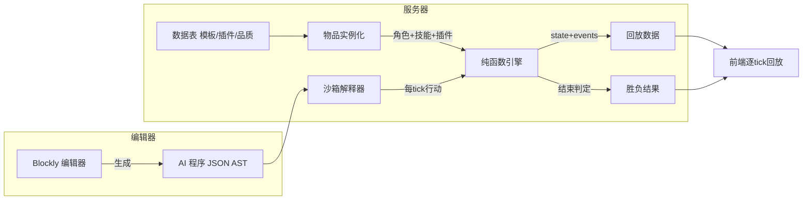

# Debug-Lite v3 完整设计文档

> 版本：v3.0（草案）　更新：2026-09-10
> 本文档是 v3 的唯一权威设计来源。实现时若与本文档冲突，以本文档为准，并同步更新本文档。
> v2 代码已归档至 `legacy/`，本文档描述的是全新架构。

---

## 目录

1. [概述](#1-概述)
2. [术语表](#2-术语表)
3. [架构总览](#3-架构总览)
4. [物品系统](#4-物品系统)
5. [角色系统](#5-角色系统)
6. [技能系统](#6-技能系统)
7. [弹幕系统](#7-弹幕系统)
8. [效果系统](#8-效果系统)
9. [场地](#9-场地)
10. [战斗流程与结束判定](#10-战斗流程与结束判定)
11. [AI 逻辑系统](#11-ai-逻辑系统)
12. [排位与解锁系统](#12-排位与解锁系统)
13. [数据模型（JSON Schema）](#13-数据模型json-schema)
14. [数值设计](#14-数值设计)
15. [实现要点](#15-实现要点)
16. [路线图](#16-路线图)
17. [开放问题](#17-开放问题)
附录 A. [系统文档索引](#附录-a-系统文档索引)

---

## 1. 概述

### 1.1 游戏定位

Debug-Lite v3 是一款「**编程式自动对战**」游戏：

- 玩家不直接操控角色，而是为角色**编写 AI 逻辑**（数据读取 + 运算 + 循环/分支 + 概率随机）。
- 角色的强度来自**物品**：角色模板、技能模板、角色插件、技能插件，均有品质。
- 战斗由服务器**逐 tick 确定性模拟**，双方 AI 每个 tick 同时决策，自动战斗直到分出胜负。
- 通过**排位赛**（异步快照对战）晋升段位，段位越高可获得越高品质的物品。

### 1.2 与 v2 的本质差异

| 维度 | v2 | v3 |
|---|---|---|
| 玩家输入 | 预编程 16-tick 行动序列 | 编写 AI 逻辑，每 tick 动态决策 |
| 战斗时长 | 16 tick 回合制 | 最长 64 tick 连续自动战斗 |
| 角色 | 4 个固定角色 | 角色模板 + 品质随机 + 插件 |
| 技能 | 固定技能 + 简单自定义 | 技能模板 + 品质随机 + 插件 |
| 成长 | 无 | 开箱/物品/装配 |
| 对战 | 实时联机 | 异步快照排位 |

### 1.3 设计原则

1. **确定性**：相同初始状态 + 相同种子 → 完全相同的战斗轨迹。这是回放、排位离线结算、AI 测试的共同地基。
2. **数据驱动**：模板/插件/词条/品质全部是数据表，逻辑统一由解释器处理，不写死在引擎里。
3. **纯函数引擎**：引擎核心不碰 IO、不碰全局随机，随机走可注入种子 RNG。
4. **安全执行**：AI 程序是 JSON AST，由服务端沙箱解释器执行，禁 `eval`，限步数限时。

### 1.4 本版更新要点

- **段位解锁**：绿→条件分支，蓝→循环 + 特化模板，橙→专家模板，青→函数；部分技能随进度解锁（§12）。
- **美术/音乐**：不沿用 v2 资源；美术先用像素画占位，将来替换为图片素材；音乐暂不实现（§15.6）。
- **AI 续执行**：AI 一直运行直到选出一个行动，然后在此断点挂起，下一 tick 从断点继续（§11.4）。
- **插件功能分类**：插件按功能分类命名，功能写入描述与词条；模板有专有名称（§4.5、§6.3）。
- **AI 合法性检测**：可能死循环的位置必须存在行动，防止 AI 找不到行动而卡死（§11.7）。
- **分系统文档**：每个系统一份独立详细文档，见 `docs/systems/`（附录 A）。
- **物品仓库与出战配置**：分类存储仓库 + 组装/拆卸；出战配置 = 角色模板及插件 + 三个技能模板及插件 + AI，本地存储可读写（§4.6、§12.2）。
- **控制效果复写**：控制效果在 AI 返回行动后应用，复写 AI 行动（§8.4、§10.1）。
- **暴击与背击**：暴击 1.5 倍、背后受击 1.5 倍，可叠加；各攻击类型判定见 §14.2。
- **48→64 tick 保障**：48 tick 起双方基地+角色每 tick 扣 6.25%（向上取整），保证 64 tick 前结束（§10.3）。
- **渲染状态差异**：引擎输出两 tick 间全局状态差异供前端绘制（§15.2）。
- **AI 执行轨迹**：战斗中实时展示 AI 每一步判断与执行位置（§11.10）。
- **物品数据文档**：`docs/items-data.md` 描述所有物品数值与贴图（附录 A）。

---

## 2. 术语表

| 术语 | 含义 |
|---|---|
| 模板（Template） | 角色模板 / 技能模板，含基础属性与插槽 |
| 插件（Plugin） | 角色插件 / 技能插件，含词条（属性加成/特殊效果） |
| 词条（Affix） | 插件携带的具体效果，如 `atk +15%`、`暴击率 +8%` |
| 品质（Quality） | 绿/蓝/紫/橙/青 五档，决定属性随机区间与插槽数 |
| 五维 | hp/atk/def/sp/mp 五个基础属性 |
| 弹幕等级 | 1~4，1 最高，决定弹幕碰撞优先级 |
| tick | 战斗最小时间单位，每 tick 双方各决策一次并同时行动 |
| 快照（Snapshot） | 某玩家「出战配置」的不可变副本，供排位离线对战使用 |
| 段位（Tier） | 排位等级，决定可抽取/可获得物品的品质上限 |
| 解锁（Unlock） | 游戏内容（AI 语法/模板/技能）随段位/进度开放的门控机制 |

---

## 3. 架构总览

### 3.1 目录结构

```
Debug-lite/
├── legacy/                    # v2 归档（server/public/data/docs/package.json...）
├── package.json               # v3
├── server/
│   ├── index.js               # HTTP + 静态服务 + REST API
│   ├── core/
│   │   ├── rng.js             # 种子随机数生成器（mulberry32）
│   │   ├── field.js           # 16 格场地、基地、边界
│   │   ├── roles.js           # 角色模板实例化、属性、插槽
│   │   ├── skills.js          # 技能模板实例化、4 类型行为
│   │   ├── bullets.js         # 弹幕：每 tick 位置、等级碰撞、速度、消失
│   │   ├── effects.js         # 持续效果 + 控制效果结算
│   │   ├── items.js           # 物品：品质区间、开箱、装配词条应用
│   │   ├── unlock.js          # 段位解锁（内容门控）
│   │   └── engine.js          # 纯函数 tick 引擎（核心编排）
│   ├── ai/
│   │   ├── ast.js             # AI 程序 JSON schema + 静态校验
│   │   └── runtime.js         # 沙箱解释器
│   ├── ranked.js              # 排位（延后实现，接口预留）
│   └── store.js               # 存档（延后实现，接口预留）
├── server/data/               # 数据表（可被前端静态加载）
│   ├── role-templates.json
│   ├── skill-templates.json
│   ├── plugins.json
│   ├── qualities.json
│   └── items-config.json      # 开箱概率等
├── public/
│   ├── index.html
│   ├── css/style.css
│   └── js/
│       ├── render/            # 像素占位渲染器（不沿用 v2 资源）
│       ├── editor/            # Blockly 集成 + 自定义积木 + AST 转换
│       └── app.js             # UI 编排
├── assets/                    # 占位像素资源表（将来替换为图片素材）
│   ├── sprites.json
│   └── animations.json
├── tests/                     # 引擎单元测试 + 种子复现测试
└── docs/
    ├── v3-design.md           # 本文档
    └── systems/               # 每系统一份详细文档（附录 A）
```

### 3.2 数据流



### 3.3 模块职责

| 模块 | 职责 | 依赖 |
|---|---|---|
| `rng.js` | 种子 RNG，可序列化状态 | 无 |
| `field.js` | 坐标越界判定、基地位置 | 无 |
| `roles.js` | 模板→角色实例（属性/插槽/五维） | `items.js` |
| `skills.js` | 模板→技能实例（4 类型参数解析） | `items.js` |
| `bullets.js` | 弹幕生成、推进、碰撞、消失 | `field.js` |
| `effects.js` | 效果新增/结算/到期清理 | 无 |
| `items.js` | 品质随机、插槽数、开箱、词条应用 | `rng.js` |
| `unlock.js` | 段位解锁门控（语法/模板/技能） | 无 |
| `engine.js` | tick 循环编排、结束判定、事件流 | 以上全部 |
| `ast.js` | AI 程序结构定义与校验 | 无 |
| `runtime.js` | 解释 AI 程序，返回行动 | `ast.js`、`rng.js` |

---

## 4. 物品系统

### 4.1 概念

> **一切模板和插件都是物品。**

- **模板**：角色模板、技能模板。含基础属性与**插槽**。
- **插件**：角色插件、技能插件。含**词条**。

### 4.2 品质

五档品质，决定物品属性的随机区间，并影响插槽数与插件点数：

| 品质 | id | 色值 | 属性系数区间 | 角色插槽数 | 技能插槽数 | 最大插件点数（建议） |
|---|---|---|---|---|---|---|
| 绿 | common | `#2ecc71` | 0.80 ~ 1.05 | 1 ~ 3 | 0 ~ 1 | 3 |
| 蓝 | rare | `#3498db` | 1.00 ~ 1.25 | 2 ~ 4 | 0 ~ 2 | 4 |
| 紫 | epic | `#9b59b6` | 1.20 ~ 1.45 | 3 ~ 5 | 1 ~ 3 | 5 |
| 橙 | legendary | `#e67e22` | 1.40 ~ 1.70 | 4 ~ 6 | 2 ~ 4 | 6 |
| 青 | mythic | `#1abc9c` | 1.60 ~ 2.00 | 5 ~ 7 | 3 ~ 4 | 7 |

- **属性系数**：物品生成时，每个数值属性 = `基础值 × U(区间)`，其中 `U` 是在品质系数区间内的均匀随机。
- **插槽数**：角色/技能分别在对应区间内均匀随机取整。
- **插件强度档位**：每品质把系数区间划分为三档，档位越高词条越强、消耗越高（§4.5）。
- **插件点数**：角色模板有「最大插件点数」；装配的插件点数总和必须 ≤ 最大点数（§4.5）。

### 4.3 获取

- **开箱**：消耗货币/次数，按 `items-config.json` 的品质概率表随机抽取物品（见 §14）。
- 排位奖励：段位越高，奖励物品的品质上限越高（见 §12）。

### 4.4 物品实例结构

```jsonc
{
  "uid": "item_8f3a...",       // 唯一 id
  "kind": "role",               // role | skill | rolePlugin | skillPlugin
  "templateId": "role_bal",
  "quality": "epic",
  "slotCount": 4,
  "slots": [                    // 模板才有（角色：atk/def/hp/sp/mp/special；技能：basic/special）
    { "type": "atk", "pluginUid": null },
    { "type": "special", "pluginUid": "item_..." },
    { "type": "def", "pluginUid": null }
  ],
  "stats": { "hp": 132, "atk": 15, "def": 11, "sp": 70, "mp": 55 }, // 生成时已含品质系数
  "affixes": [ { "id": "atk_pct_15", "params": { "v": 0.15 } } ]     // 插件才有
}
```

### 4.5 插件功能分类、档位与命名

- 每个插件必须声明 `slot`（可装的插槽类型）、`category`（功能分类）与 `name`（专有名称），功能同时写入 `desc` 与每个词条的 `desc`。
- `name` 简洁直白（如「攻击提升」「SP 优化」）；具体命名与词条数值见 `docs/items-data.md`。
- 角色插槽类型：攻击槽位 / 防御槽位 / 生命槽位 / SP 槽位 / MP 槽位 / 特殊槽位；五维类插件分「百分比 / 数值」两种，均装对应五维槽位。
- 技能插槽类型：基础槽位（修改基本属性）/ 特殊槽位（特殊效果）。
- **强度档位**：同品质插件分三档，档位决定词条数值强弱与消耗——
  - 角色插件：点数消耗 = 档位（1 / 2 / 3）。
  - 技能插件：资源消耗增量 = 档位 × 品质基础值（绿 2 → +2/+4/+6）。
- 角色模板有「最大插件点数」，装配的插件点数总和 ≤ 最大点数（§4.2）。

### 4.6 仓库、组装与拆卸（本地存储）

- **仓库**：玩家物品按分类（角色模板 / 技能模板 / 角色插件 / 技能插件）分桶存储，记录每个物品实例及其当前装配状态（`equipped` 标记）。
- **组装**：把插件装配到角色/技能模板的空插槽；校验插槽类型与段位门控，成功后写入 `slot.pluginUid`，插件标记为「已装配」。
- **拆卸**：把已装配插件从插槽移除，恢复为「未装配」，回到仓库。
- **出战配置**：从仓库选择 1 个角色模板 + 3 个技能模板，连同各自插件与 AI 程序组成 `loadout`（§12.2）。
- 仓库与出战配置均序列化为 JSON，存储于玩家本地（浏览器 localStorage），支持修改与读取。

---

## 5. 角色系统

### 5.1 角色模板

基础属性（五维）：`hp`、`atk`、`def`、`sp`、`mp`。

三种类型，**共 11 种**；命名规则：均衡叫「均衡」，特化与专家都**只按最高属性**命名「特化·xx」「专家·xx」，其余属性随机。

| 类型 | 种数 | 说明 | 属性分配 |
|---|---|---|---|
| 均衡 | 1 | 标准属性范围 | 全部标准 |
| 特化 | 5（HP/攻击/防御/SP/MP） | 最高属性略高，其余随机 | 1 高(+15%)、其余 4 属性随机取 1 低(-15%) + 3 标准 |
| 专家 | 5（HP/攻击/防御/SP/MP） | 最高属性极高，其余随机 | 1 极高(+30%)、其余 4 属性随机分配 略高(+10%) / 极低(-30%) / 略低(-10%) / 标准 |

- 示例：「特化·攻击」可能是「高攻击低生命」或「高攻击低法力」，二者都归类为「特化·攻击」。
- 具体 11 种模板见 `docs/items-data.md` §3。
- 百分比修饰作用于**基础值**后再乘以品质系数（顺序：基础值 → 类型修饰 → 品质系数 → 取整）。

### 5.2 角色模板插槽与插件点数

| 插槽类型 | 可插 |
|---|---|
| 攻击/防御/生命/SP/MP 槽位 | 对应五维插件（百分比或数值） |
| 特殊槽位 | 特殊插件（概率闪避、普攻吸血、概率暴击、回复等） |

- 插槽总数由品质决定（§4.2），各类型插槽按模板定义分配。
- 角色模板有「**最大插件点数**」属性；装配的插件点数总和必须 ≤ 最大点数（§4.2、§4.5）。

### 5.3 角色插件

**五维插件**：对 hp/atk/def/sp/mp 的加成，分两类——
- 百分比：如 `atk +15%`
- 数值：如 `hp +20`

**特殊插件**（词条示例）：
- 概率闪避（`dodgeChance`）
- 普攻吸血（`lifestealOnAttack`）
- 概率暴击（`critChance` / `critMultiplier`）
- 其他可扩展词条

---

## 6. 技能系统

### 6.1 技能模板基本属性

| 字段 | 说明 |
|---|---|
| `type` | 近战 `melee` / 平射 `straight` / 垂直 `vertical` / 位移 `displacement` |
| `multiplier` | 倍率，伤害 = ATK × 倍率（再走防御/真实伤害公式） |
| `cost` | 消耗 `{ hp, mp, sp }` |
| `cooldown` | 冷却（tick 数） |
| `bulletLevel` | 弹幕等级 1~4（1 最高） |

### 6.2 四种类型及特殊属性

#### 6.2.1 近战 `melee`

- `range`：以角色为基准的区间，`[0, 2]` 表示前方两格，`[-1, 1]` 表示前后各一格。
- **效果同时作用于范围内的每一格**（每个格子独立判定命中）。

```jsonc
{ "type": "melee", "range": [0, 2], "bulletLevel": 2, "multiplier": 1.0, "cost": {"hp":0,"mp":0,"sp":12}, "cooldown": 2 }
```

#### 6.2.2 平射 `straight`

- `range`：射程（最远格数，整数）。
- `bulletCount`：弹幕数量。
- `bulletSpeed`：弹幕速度（格/tick）。
- **效果只作用于弹幕命中的一格**（落点格）。

```jsonc
{ "type": "straight", "range": 7, "bulletCount": 3, "bulletSpeed": 3, "bulletLevel": 3, "multiplier": 1.2, "cost": {"hp":0,"mp":6,"sp":0}, "cooldown": 3 }
```

#### 6.2.3 垂直 `vertical`

- `range`：射程（最远落点距离，以角色为起点的格数）。
- `area`：以落点为基准的范围区间，计算方式同近战 `range`。
- **效果作用于范围内的每一格**。

```jsonc
{ "type": "vertical", "range": 5, "area": [-1, 1], "bulletLevel": 4, "multiplier": 1.0, "cost": {"hp":0,"mp":10,"sp":0}, "cooldown": 4 }
```

#### 6.2.4 位移 `displacement`

- `distance`：位移距离（格）。
- `passThroughEnemy`：是否穿过敌人（true 则无视敌人阻挡）。
- `dealDamage`：是否造成伤害（穿过/到达终点时判定）。
- `fullDodgeDuring`：位移过程中是否完全闪避。

```jsonc
{ "type": "displacement", "distance": 3, "passThroughEnemy": false, "dealDamage": true, "fullDodgeDuring": false, "multiplier": 0.8, "cost": {"hp":0,"mp":0,"sp":8}, "cooldown": 3 }
```

### 6.3 技能插件

> 规则：**除减耗类插件外，其余插件均增加技能消耗**（作为强度补偿）。

- 技能插槽分两类：**基础槽位**（修改基本属性）与**特殊槽位**（特殊效果）。
- 技能插件按槽位分类，功能显示在描述与词条中：

| 槽位 | 插件 | 词条 |
|---|---|---|
| 基础 | 倍率提升 | 倍率增加 |
| 基础 | 消耗优化 | 减消耗（此类不增加消耗） |
| 基础 | 冷却缩减 | 减冷却 |
| 基础 | 射程/弹幕/位移增强 | 加射程/范围/弹幕数量/位移距离、提高弹幕等级 |
| 特殊 | 命中回复 | 命中吸/减 hp/mp/sp |
| 特殊 | 释放增益 | 释放加 hp/mp/sp/atk/def |
| 特殊 | 控制 | 命中眩晕/击退/拉近/持续伤害 |
| 特殊 | 伤害类型 | 改为真实伤害、概率暴击 |

- 每个词条带 `costDelta`（对技能消耗的增量），档位越高增量越大（§4.5）；减耗类 `costDelta` 为 null。

---

## 7. 弹幕系统

### 7.1 弹幕实体

每个弹幕每 tick 有**唯一位置**和其**下一 tick 将经过的位置**。

```jsonc
{
  "uid": "bullet_...",
  "owner": "p1",              // p1 | p2
  "skillId": "skill_...",
  "level": 2,                 // 1 最高，4 最低
  "type": "straight",         // melee | straight | vertical
  "dir": 1,                   // 1 右，-1 左
  "speed": 3,                 // 格/tick（melee 为 0）
  "x": 6,                     // 当前 tick 位置（格坐标，可为小数）
  "pathThisTick": [7, 8, 9],  // 本 tick 将经过的格（由速度算出）
  "maxRange": 7,              // 最远射程（格数）
  "traveled": 0,              // 已飞行距离
  "payload": { "multiplier": 1.2, "affixes": [...] }  // 命中时结算的伤害/词条
}
```

### 7.2 弹幕等级与碰撞

- 等级：`1` 最高，`4` 最低。
- **高级弹幕穿过低级弹幕**；**同级弹幕相互抵消**；**低级弹幕被高级弹幕抵消**。

### 7.3 弹幕速度与推进

- `speed`（格/tick）决定本 tick 经过哪些格，用于处理弹幕碰撞、命中、消失事件。
- 推进时按经过的格子**从近到远**逐个判定事件。

### 7.4 消失规则

- **近战弹幕**：速度 = 0，总是**下一 tick 立即消失**。
- **平射弹幕**：命中敌人 / 被高级或同级弹幕阻挡 / 达到最远射程 时消失，**依距离从近到远依次判断**（三者同时满足时，按阻挡 → 命中 → 射程的优先级，先触发者生效）。

---

## 8. 效果系统

### 8.1 结算时机

> **每 tick 前优先结算所有效果。**

### 8.2 持续效果（DoT / Buff / Debuff）

```jsonc
{
  "uid": "eff_...",
  "kind": "continuous",
  "target": "p2",
  "stat": "hp",        // hp | mp | sp | atk | def
  "delta": -6,         // 每回合 ± 值
  "remaining": 3,      // 剩余回合数
  "source": "p1"
}
```

- 每 tick 结算一次：`stat += delta`，`remaining -= 1`，归零移除。
- 支持「± 固定数值直到 buff 结束」——等价于 `remaining` 足够大或标记为 `untilEnd` 的持续效果。

### 8.3 控制效果

```jsonc
{
  "uid": "eff_...",
  "kind": "control",
  "target": "p2",
  "displacement": -2,  // 正负表示左右，数值表示距离，0 表示原地（眩晕）
  "remaining": 2,
  "source": "p1"
}
```

- 将受到效果的角色**本回合行动强制改为该效果**：
  - `displacement > 0`：本 tick 行动 = 向右移动 N 格。
  - `displacement < 0`：本 tick 行动 = 向左移动 N 格。
  - `displacement = 0`：本 tick 行动 = 原地不动（即眩晕）。
- `remaining -= 1`，归零移除。

### 8.4 结算顺序

```
每 tick：
  1) 结算所有持续效果（增减属性/血量）
  2) 将结算后的状态交给 AI
  3) AI 返回行动后，结算控制效果：把 AI 返回的行动复写为该效果
```

---

## 9. 场地

- **横向 16 格**：坐标 `0 ~ 15`。
- 两侧边界为**基地**：P1 基地在格 0 左侧，P2 基地在格 15 右侧。
- 双方初始位置：**P1 在左第 4 格（x=3），P2 在右第 4 格（x=12）**。
- P1 初始朝右（facing=1），P2 初始朝左（facing=-1）。

```jsonc
{
  "width": 16,
  "bases": { "p1": { "x": 0, "hp": 100, "maxHp": 100, "def": 64 }, "p2": { "x": 15, "hp": 100, "maxHp": 100, "def": 64 } },
  "startX": { "p1": 3, "p2": 12 },
  "startFacing": { "p1": 1, "p2": -1 }
}
```

---

## 10. 战斗流程与结束判定

### 10.1 tick 循环（7 步）

1. 获取当前 tick 场上状态（快照）。
2. 结算持续效果（增减属性/血量，见 §8.4）。
3. 把结算后的状态传给双方 AI，AI 续执行各产出本 tick 行动。
4. 结算控制效果：把 AI 返回的行动复写为该效果（位移/眩晕，见 §8.4）。
5. 双方**同时行动**，在初始位置生成弹幕（应用位移/转向/防御/技能释放）。
6. 计算弹幕运动、角色运动并处理碰撞事件（角色阻挡、弹幕命中/抵消、新创建的效果等），得到计算后的场上状态。
7. 输出本 tick 状态差异与事件（§15.2），把场上状态传到下一 tick，回到第 1 步。

### 10.2 行动集

| 行动 | 说明 |
|---|---|
| `move_left` / `move_right` | 左/右移 1 格 |
| `dodge_left` / `dodge_right` | 左/右闪（快速位移，可附带闪避判定） |
| `skill1` / `skill2` / `skill3` | 释放装备的第 1/2/3 个技能 |
| `defend` | 防御（本 tick 减伤） |
| `turn` | 转向（翻转朝向） |

### 10.3 结束判定（优先级排序，同时发生则平局）

1. 一方**基地血量 ≤ 0** → 另一方胜。
2. 一方**角色血量 ≤ 0** → 另一方胜。
3. 战斗满 **48 tick** 后，每 tick 双方**基地和角色同时扣除血量上限的 6.25%（向上取整）**血量，直到触发上面两个条件之一。

> 设计意图：6.25% × 16 tick（48→64）= 100%，向上取整保证即便角色能回血，基地血量也必然在 **64 tick 前**归零，从而确保战斗一定结束（最长 64 tick）。
> 实现注意：48 tick 后的扣血发生在 tick 流程第 2 步（持续效果结算）之后、第 7 步（传入下一 tick）之前；需保证「同时扣血」在同一时刻结算，避免先后顺序造成偏差。

---

## 11. AI 逻辑系统

### 11.1 可获取数据（读取）

| 目标 | 字段 |
|---|---|
| 我方 | `hp` `atk` `def` `sp` `mp` `x` `baseHp`（我方基地血量）`facing` |
| 敌方 | `hp` `atk` `def` `sp` `mp` `x` `baseHp`（敌方基地血量）`facing` |
| 场上弹幕 | 弹幕位置、速度、等级、归属（`bullets` 数组） |
| 局部变量 | AI 程序自己声明的变量（跨 tick 持久） |

### 11.2 运算

| 类别 | 运算符 |
|---|---|
| 比较 | `>` `=` `<` `≥` `≤` `≠` |
| 逻辑 | 与（and）、或（or）、非（not） |
| 算术 | 加、减、乘、除 |
| 随机 | 概率随机（`random(p)`，返回 true 的概率为 p） |

### 11.3 循环、分支与函数

| 结构 | 说明 |
|---|---|
| 次数循环 | `for n times { body }` |
| 条件循环 | `while cond { body }` |
| 跳出循环 | `break` |
| 条件分支 | `if cond { A } else { B }` |
| 函数 | 命名语句块，`call` 调用（青段位解锁） |

### 11.4 执行模型：续执行（coroutine）

- 每个 AI 程序实例持有**跨 tick 的执行上下文**：程序计数器（PC）、变量作用域、调用栈。
- 每 tick：运行时从上次挂起点**继续**执行，直到遇到 `action` 节点 → 产出该行动并**挂起**（保存断点）。
- 下一 tick 从断点**接着**执行，而不是从头重跑。
- 战斗开始时 PC 指向程序入口（顶层 `seq` 第一条语句）；战斗结束销毁上下文。
- `action` 的语义：产出行动 → 挂起 → 下一 tick 从该 `action` 的下一条语句继续。
- 变量与断点跨 tick 持久，因此 AI 天然是「有状态的脚本」，可表达「上一 tick 我在做什么」。

### 11.5 AST 定义

AI 程序是一个「产出一连串行动」的协程 AST。前端 Blockly 生成 AST，服务端解释器执行。

```jsonc
{
  "type": "program",
  "version": 1,
  "body": { "type": "seq", "statements": [ /* ... */ ] }
}
```

节点类型：

| 节点 | 字段 | 说明 |
|---|---|---|
| `literal` | `value` | 数值/布尔常量 |
| `get` | `target`, `field` | 读取 `self`/`enemy` 的字段 |
| `bullets` | `filter` | 读取场上弹幕（可按 owner/level/dir 过滤） |
| `var` | `name`, `init` | 声明局部变量（跨 tick 持久） |
| `set` | `name`, `value` | 给局部变量赋值 |
| `getVar` | `name` | 读取局部变量 |
| `arith` | `op`, `left`, `right` | 加减乘除 |
| `cmp` | `op`, `left`, `right` | 比较运算 |
| `logic` | `op`, `operands` | 与/或/非 |
| `random` | `prob`, `then`, `else` | 概率分支 |
| `if` | `cond`, `then`, `else` | 条件分支 |
| `loop` | `kind`(`count`/`while`), `times`/`cond`, `body` | 循环 |
| `break` | — | 跳出循环 |
| `function` | `name`, `body` | 函数定义（青解锁） |
| `call` | `name` | 调用函数 |
| `action` | `name` | 输出行动并挂起 |
| `seq` | `statements` | 顺序执行 |

### 11.6 解释器约定

- **续执行**（§11.4），不是每 tick 重跑。
- 遇到 `action` → 产出行动并挂起，保存断点返回。
- 随机：仅在**实际求值** `random` 时消耗战斗 RNG；挂起不消耗。每 tick 用 `hash(seed, tick)` 派生子种子。
- 读取为**只读快照**，不允许写回战场状态；只有局部变量可写。
- 非法/越界访问返回安全默认值（0 或 false）。
- 运行时兜底：单 tick 步数上限（如 10,000）；超限返回保底行动 `defend` 并记录诊断，不卡死。

### 11.7 合法性检测（防死循环）

静态检测（`ast.js` 编译期，服务端 + 编辑器共用）：

1. 程序整体必须存在至少一个**可达**的 `action` 节点，否则拒绝（永远选不出行动）。
2. 每个 `loop`（count/while）的 `body` 内必须存在至少一个 `action` 节点（含嵌套函数内的循环），否则拒绝：该循环可能死循环。
3. 函数体内若含循环，同样满足规则 2。
4. `while` 条件恒为真且 body 无 `action` → 由规则 2 覆盖拒绝。

编辑器（Blockly）在生成 AST 时**实时**提示违反规则 1/2 的积木组合。

### 11.8 函数（青段位解锁）

- `function` 定义命名语句块，拥有独立的局部变量作用域；`call` 调用。
- 函数体内的 `action` 同样触发挂起（断点可位于函数内部，下一 tick 从函数内继续）。
- 第一版：函数无参数、无返回值；参数/返回值预留扩展。

### 11.9 示例 AI（伪 AST，续执行）

```
变量 模式 = "接近"

函数 靠近():
    若 自己.x < 敌方.x → 产出 move_right
    否则 → 产出 move_left

while 自己.hp > 0:                      # 循环体含 action，合法
    模式 = (敌方.hp < 自己.atk * 1.5) ? "攻击" : "接近"
    若 模式 == "攻击" → 产出 skill1      # 挂起，下一 tick 从此处继续
    否则 → 调用 靠近()                   # 函数内的产出同样挂起
```

### 11.10 执行轨迹（AI 可视化）

- 解释器每求值一个节点，向本 tick 的执行轨迹追加一条记录：节点 id、类型、求值结果（条件真假、分支走向、循环次数、最终行动）。
- 引擎把轨迹放进本 tick 的状态差异（§15.2），前端据此实时展示「某个条件是否判断成功、具体运行到哪一步」。
- Blockly 编辑器按轨迹高亮当前执行的积木，逐节点回放 AI 的思考过程。

---

## 12. 排位与解锁系统

### 12.1 段位解锁（内容门控）

- 游戏内容按段位/进度解锁，未解锁内容不可见或置灰。
- 解锁表数据驱动（`unlock.json`），由 `unlock.js` 门控。

| 段位 | AI 语法解锁 | 模板解锁 | 其他 |
|---|---|---|---|
| 绿 common | 条件分支（if/else） | 均衡模板 | 基础技能 |
| 蓝 rare | 循环（for/while/break） | 特化模板 | 进阶技能 |
| 紫 epic | 概率随机、更多运算符 | — | 进阶技能 |
| 橙 legendary | — | 专家模板 | 高阶技能 |
| 青 mythic | 函数（function/call） | — | 顶级技能 |

- 绿→条件分支、蓝→循环、青→函数、蓝→特化模板、橙→专家模板为用户明确指定；紫段位与部分技能为设计补充，待确认（§17）。
- 门控位置：Blockly 编辑器隐藏/禁用未解锁积木；未解锁模板/技能不进掉落池；服务端校验玩家段位与所用语法/模板/技能匹配。
- 技能随进度解锁：技能模板带 `unlockTier` 字段，段位不足不产出、不可装备。

### 12.2 出战配置

一套完整出战配置（`loadout`）包含四部分，均存储在玩家本地、可读写：

1. 角色模板及其装配的插件。
2. 该角色装备的三个技能模板（技能 1/2/3）及其各自的插件。
3. 角色的战斗 AI（AI 程序）。

```jsonc
{
  "playerId": "player_...",
  "tier": 3,
  "loadout": {
    "role": { "uid": "item_...", "templateId": "...", "quality": "epic", "slots": [ /* 已装配插件 */ ] },
    "skills": [
      { "sid": "skill1", "uid": "item_...", "templateId": "...", "slots": [ /* 已装配插件 */ ] },
      { "sid": "skill2", "uid": "item_...", "templateId": "...", "slots": [ /* 已装配插件 */ ] },
      { "sid": "skill3", "uid": "item_...", "templateId": "...", "slots": [ /* 已装配插件 */ ] }
    ],
    "ai": { "type": "program", "version": 1, "body": { /* AST */ } }
  }
}
```

- 本地存储：`loadout` 与物品仓库都以 JSON 序列化存于玩家本地（浏览器 localStorage），支持修改与读取。

### 12.3 匹配与晋升

- 每次战斗：**抽取 10 个同段位玩家的出战配置快照**，依次与其战斗。
- **一次性战胜超过 x 个则晋升下一段位**（`x` 默认 6，见 §17）。
- 随段位提升，玩家可获得**更高品质**的物品。

### 12.4 实现说明（延后）

- 存档/账号系统延后（见 §17）。先预留 `ranked.js` 与 `store.js` 接口。
- 快照是**不可变副本**，离线运行对手 AI，不要求对手同时在线。

---

## 13. 数据模型（JSON Schema）

### 13.1 `role-templates.json`

```jsonc
{
  "roleTemplates": [
    {
      "id": "role_spc_atk",
      "name": "特化·攻击",
      "type": "specialized",         // balanced | specialized | expert
      "highStat": "atk",             // 高属性（特化/专家命名依据）
      "baseStats": { "hp": 100, "atk": 10, "def": 8, "sp": 60, "mp": 40 },
      "pluginPoints": 3,             // 最大插件点数
      "slotWeights": { "atk": 2, "def": 1, "hp": 0, "sp": 0, "mp": 0, "special": 1 }  // 插槽类型分配权重
    }
  ]
}
```

### 13.2 `skill-templates.json`

```jsonc
{
  "skillTemplates": [
    {
      "id": "skill_melee_slash",
      "name": "横斩",
      "type": "melee",
      "baseMultiplier": 1.0,
      "baseCost": { "hp": 0, "mp": 0, "sp": 12 },
      "cooldown": 2,
      "bulletLevel": 2,
      "range": [0, 2]
    },
    {
      "id": "skill_straight_shot",
      "name": "平射",
      "type": "straight",
      "baseMultiplier": 1.2,
      "baseCost": { "hp": 0, "mp": 6, "sp": 0 },
      "cooldown": 3,
      "bulletLevel": 3,
      "range": 7,
      "bulletCount": 3,
      "bulletSpeed": 3
    }
  ]
}
```

### 13.3 `plugins.json`

```jsonc
{
  "plugins": [
    {
      "id": "p_atk_pct",
      "kind": "rolePlugin",          // rolePlugin | skillPlugin
      "slot": "atk",                 // 角色：atk/def/hp/sp/mp/special；技能：basic/special
      "category": "攻击提升",
      "name": "攻击提升",             // 简洁直白命名
      "desc": "攻击提升（百分比）",
      "affixes": [ { "id": "atk_pct", "desc": "攻击 +8%", "params": { "v": 0.08 } } ],
      "pointCostByTier": [1, 2, 3]   // 角色插件：档位 1/2/3 的点数消耗
    },
    {
      "id": "p_skill_range_plus",
      "kind": "skillPlugin",
      "slot": "basic",               // 技能：basic（基础）/ special（特殊）
      "name": "射程增强",
      "affixes": [ { "id": "range_plus", "params": { "v": 2 } } ],
      "costDeltaByTier": { "hp": [0,0,0], "mp": [2,4,6], "sp": [0,0,0] }  // 档位 1/2/3 的消耗增量
    },
    {
      "id": "p_skill_cost_down",
      "kind": "skillPlugin",
      "slot": "basic",
      "name": "消耗优化",
      "affixes": [ { "id": "cost_down", "params": { "v": 0.2 } } ],
      "costDeltaByTier": null        // 减耗类不增加消耗
    }
  ]
}
```

### 13.4 `qualities.json`

```jsonc
{
  "qualities": [
    { "id": "common",    "name": "绿", "color": "#2ecc71", "statRange": [0.80, 1.05],
      "roleSlotRange": [1, 3], "skillSlotRange": [0, 1], "pluginPoints": 3,
      "tiers": [[0.80, 0.88], [0.88, 0.97], [0.97, 1.05]] },
    { "id": "rare",      "name": "蓝", "color": "#3498db", "statRange": [1.00, 1.25],
      "roleSlotRange": [2, 4], "skillSlotRange": [0, 2], "pluginPoints": 4 },
    { "id": "epic",      "name": "紫", "color": "#9b59b6", "statRange": [1.20, 1.45],
      "roleSlotRange": [3, 5], "skillSlotRange": [1, 3], "pluginPoints": 5 },
    { "id": "legendary", "name": "橙", "color": "#e67e22", "statRange": [1.40, 1.70],
      "roleSlotRange": [4, 6], "skillSlotRange": [2, 4], "pluginPoints": 6 },
    { "id": "mythic",    "name": "青", "color": "#1abc9c", "statRange": [1.60, 2.00],
      "roleSlotRange": [5, 7], "skillSlotRange": [3, 4], "pluginPoints": 7 }
  ]
}
```

### 13.5 `items-config.json`

```jsonc
{
  "dropRates": {
    "common": 0.55, "rare": 0.28, "epic": 0.12, "legendary": 0.04, "mythic": 0.01
  },
  "kindWeights": { "role": 1, "skill": 1, "rolePlugin": 2, "skillPlugin": 2 }
}
```

---

## 14. 数值设计

### 14.1 属性基础值（均衡型、绿品质、无插件）

| 属性 | 基础值 | 说明 |
|---|---|---|
| hp | 100 | 生命 |
| atk | 10 | 攻击（伤害 = ATK × 倍率） |
| def | 8 | 防御（减伤） |
| sp | 60 | 体力（位移/部分技能消耗） |
| mp | 40 | 法力（技能消耗） |

### 14.2 伤害公式

- 普通伤害：`max(1, floor(ATK × 倍率 × (1 - DEF / (DEF + 40))))`
- 真实伤害（词条）：`max(1, floor(ATK × 倍率))`
- 暴击：伤害 × 1.5（默认倍率，可由词条调整）。
- 背后受击（背击）：伤害 × 1.5。
- 暴击与背击**可叠加**（同时满足 × 2.25）。

**背击判定**（在命中结算时判定）：

| 攻击类型 | 判定依据 |
|---|---|
| 近战 / 位移 | 看两个角色**释放技能前**（本 tick 移动前）的相对位置与朝向：攻击方位于受击方朝向的反方向（身后）→ 背击 |
| 平射弹幕 | 看弹幕**飞来的方向**与受击方朝向：弹幕来自受击方身后 → 背击 |
| 垂直弹幕 | 永远不触发背击 |

### 14.3 技能点数定价框架

沿用 `legacy/docs/技能点数换算系统.md` 的思路，将每个技能属性映射为点数，再映射为消耗/冷却。v3 中：

- 每个技能模板有 `baseCost` + `cooldown` 作为起点。
- 插件词条在增加强度时**同步增加消耗**（§6.3），减耗类除外。
- 数值平衡阶段用点数框架校准各模板与词条的性价比。

### 14.4 恢复

- 每 tick：`mp += mpRegen`、`sp += spRegen`（上限封顶）。
- 初始建议：`mpRegen = 1`、`spRegen = 2`，可由角色模板/插件修改。

---

## 15. 实现要点

### 15.1 确定性

- RNG 用 `mulberry32(seed)`，战斗开始时以种子初始化，每 tick 用 `hash(seed, tick)` 派生子种子。
- **禁止**在引擎内直接调用 `Math.random`。
- 所有随机（物品生成、AI 概率、暴击、闪避）都走同一个 RNG 链。

### 15.2 事件流与状态差异

引擎每 tick 输出**两 tick 间计算后的全局状态差异（diff）**，供前端绘制运动与特效：

```jsonc
{
  "tick": 5,
  "diff": {
    "players": [
      { "actor": "p1", "fromX": 3, "toX": 4, "fromFacing": 1, "toFacing": 1,
        "hpDelta": 0, "mpDelta": -6, "spDelta": -8,
        "buffs": [ { "effect": { "uid": "...", "kind": "continuous", "stat": "atk", "delta": 2 } } ] }
    ],
    "bullets": [
      { "uid": "...", "path": [4, 5, 6], "hitAt": 7 },
      { "uid": "...", "clashAt": 6, "vsUid": "...", "winner": "p1" }
    ],
    "bases": [ { "owner": "p2", "hpDelta": -10 } ],
    "events": [ /* 有序事件：命中/抵消/效果添加/资源变化 */ ],
    "aiTrace": [ /* AI 执行轨迹，见 §11.10 */ ]
  }
}
```

- 状态差异包含：角色位移与朝向变化、血量/资源增减、新增/移除的 buff 粒子、弹幕飞行路径、**两弹幕在哪一格碰撞**、命中位置等。
- 前端据此插值绘制运动与粒子，而不是自行重新模拟。

### 15.3 快进与回放一致性

- 引擎提供 `runFull()`（一次性快进到结束）与 `step()`（单 tick）。
- **快进结果必须与逐 tick 回放逐帧一致**（同一状态、同一事件流），这是排位离线结算正确性的前提。
- 用种子复现测试保证。

### 15.4 安全性

- AI 程序仅含白名单节点，`ast.js` 做静态校验（拒绝未知节点/非法字段/超深嵌套）。
- `runtime.js` 限步数、限时、只读状态、返回单个行动。
- 客户端提交的 AI 程序在服务端校验并重新执行，不信任客户端结果。

### 15.5 前端编辑器

- 采用 Blockly，自定义积木覆盖 §11 的全部节点。
- 积木 ↔ AST 双向转换：编辑 → 生成 AST 存盘；载入 → AST 还原积木。
- 编辑器按玩家段位隐藏/禁用未解锁积木（§12.1）。
- 编辑器提供「战斗试运行」：本地/服务端跑一场战斗并回放。

### 15.6 美术与音乐

- **不沿用 v2 的美术与音乐资源**。
- 美术：暂时用代码绘制的像素占位（纯色方块 + 简单像素 sprite，定义在 `assets/`），渲染层只依赖这些占位资源；将来替换为图片素材（PNG）时只改 `assets/` 与资源加载器，不改游戏逻辑。
- 音乐：**暂不实现**（不迁移 v2 音乐引擎，不引入音频文件）。

---

## 16. 路线图

对应开发阶段（详见会话计划）：

| 阶段 | 内容 |
|---|---|
| P0 | 归档 v2（已完成）；新建 v3 骨架；像素占位资源与占位渲染器（不用 v2 资产） |
| P1 | 核心引擎：RNG、field、effects、bullets、roles、skills、items、unlock、engine；硬编码 AI 跑通整场；单测 + 种子复现 |
| P2 | AI 系统：ast.js（含合法性检测）、runtime.js（续执行）、Blockly 编辑器（按段位门控）、端到端跑通 |
| P3 | 物品系统：开箱、装配 UI、词条应用、数值校准 |
| P4 | 战斗回放 + 主流程串联（编辑 → 装配 → 开箱 → 对战 → 回放） |
| P5 | 排位 + 存档（延后） |

---

## 17. 开放问题

1. **晋升阈值 `x`**：默认 6，之后按胜率分布调整。
2. **词条结算优先级**：闪避、暴击、背击、吸血的判定先后需在伤害管线锁定（建议顺序：闪避 → 命中 → 背击/暴击倍率 → 减伤 → 吸血）。
3. **紫段位解锁内容**：绿/蓝/橙/青已明确，紫段位解锁项为设计补充，待确认。
4. **函数参数与返回值**：第一版函数无参无返回值，是否支持参数/返回值待定。
5. **占位美术规格**：像素占位图的具体尺寸/配色规范，见 `docs/items-data.md` 待补。
6. **本地存档 schema 版本**：仓库/出战配置的 JSON 结构需定版本号与迁移策略（P5 接入账号时再定）。
7. **排位奖励品质**与段位映射关系，待 P5 定义。

---

## 附录 A：系统文档索引

每个系统一份独立详细文档（精确到代码逻辑的自然语言描述，不写代码），位于 `docs/systems/`：

| 文档 | 系统 |
|---|---|
| `01-items.md` | 物品系统 |
| `02-roles.md` | 角色系统 |
| `03-skills.md` | 技能系统 |
| `04-bullets.md` | 弹幕系统 |
| `05-effects.md` | 效果系统 |
| `06-field.md` | 场地系统 |
| `07-engine.md` | 战斗引擎 |
| `08-ai.md` | AI 系统 |
| `09-unlock.md` | 解锁系统 |
| `10-ranked.md` | 排位系统 |
| `../items-data.md` | 物品数据文档（所有物品数值/名称/描述/贴图占位） |
| `../tasks.md` | 构建任务清单（阶段任务 / 里程碑 / 验收） |
